# 从0开始的表面反应 kMC 模拟实用指南

> 原文：Andersen M, Panosetti C and Reuter K (2019) A Practical Guide to Surface Kinetic Monte Carlo Simulations. Front. Chem. 7:202. [doi: 10.3389/fchem.2019.00202](https://doi.org/10.3389/fchem.2019.00202)
> 
> 原作者：Mie Andersen*, Chiara Panosetti and Karsten Reuter  
> 
> *Chair for Theoretical Chemistry and Catalysis Research Center, Technische Universität München, Garching, Germany
> 
> 译者：[Eight_Eggs](https://github.com/eighteggs)
>
> 完成日期：2024-07-24
>
> 注：原文所用 kMC 模拟程序为 [kmos](https://github.com/mhoffman/kmos)，译者将其适配到了更新的 [kmcos](https://github.com/kmcos/kmcos)

### 摘要

本文旨在为动力学蒙特卡罗（kMC）模拟领域的新手提供实用指南，特别是对于普遍用于表面和界面应用的晶格 kMC 模拟。我们将使用 kmcos 代码提供示例，其中强调了在实现 kMC 模型时所做的中心近似以及可能的陷阱，包括如何将问题映射到晶格上，以及推导各种基本过程的速率常数表达式。示例 kMC 模型将在表面扩散、晶体生长和非均相催化等应用领域进行介绍，涵盖瞬态和稳态动力学以及系统各种初始状态的准备。我们强调了 kMC 模型对所包含的基本过程以及速率常数中可能存在的误差的敏感性。特别是对于催化模型，一个重要的挑战是模拟不同的时间尺度上发生的过程，例如快速扩散过程和缓慢化学反应。我们演示了如何使用最近开发的加速算法来克服这个时间尺度差异问题。最后，我们将讨论如何考虑吸附到晶格上的物种之间的横向相互作用，这在本文涵盖的所有应用领域都发挥着重要作用。

### 关键词

kMC, 晶格气体模型, 表面扩散, 多相催化, 晶体生长, 灵敏度分析, 横向相互作用

## 1. 介绍

蒙特卡洛是一个广泛的总称，涵盖了许多方法，它们有一个共同的简单核心思想：使用随机数解决复杂问题。鉴于这一概念的多功能性，基于蒙特卡洛的方法在计算化学和材料科学中越来越受欢迎也就不足为奇了`（Frenkel和Smit，2001）`，最突出的是使用 Metropolis Monte Carlo 或者衍生的方法（如用于全局构型优化的 Basin Hopping）模拟系综性质。除了平衡性质，蒙特卡洛思想也可以用来解决动力学性质。从这个意义上讲，几十年来出现了许多不同名称的方法，直到动力学蒙特卡洛（kMC）开始普遍使用。

如今，kMC 是一种流行的工具，用于描述与传输（扩散）、材料的结构和性质或平衡和非平衡化学（催化）相关的各种现象。正如本文所述，在原子模拟的背景下，kMC 可以被视为一种粗粒度化。这使得它特别适合在多尺度建模方法中找到自己的位置，在这种方法中，不同精度或细节级别的模型被整合在一起，以提供对系统更全面的描述。在此背景下，kMC 是连接微观世界（原子扩散运动或化学键的形成和断裂等基本过程）与介观到宏观世界（例如扩散常数和反应速率）之间差距的重要方法。

让我们通过考虑多相催化来说明这一概念，这是 kMC 以及一般的分层级方法产生重大影响的领域之一`（Sabbe等人，2012；Reuter，2016）`。催化过程的设计需要对反应化学、反应器内热和质量传输等现象有深入的理解。数值模拟已成为这一设计过程中不可或缺的一部分，这需要在多个时间和长度尺度上建立适当的模型，最重要的是，这些模型应该如何耦合起来。可以想象，从我们生活的宏观世界和工业反应器的宏观世界“放大”，一直到微观尺度，在微观尺度上，事件最终由电子结构控制：原子和分子在表面的吸附和解吸、扩散、键断裂和键形成等（见图1）。所有这些构成了可以在催化剂和反应流之间的界面上发生的基本过程，现在可以通过第一性原理电子结构计算来详细描述。在这个尺度上，人们本质上需要的是对系统势能面（PES）的机械描述（见下文）。因此，需要一种适当的量子力学方法来以预测的方式捕捉化学的微妙之处。迄今为止，这方面的主力仍然是密度泛函理论（DFT）`（Hohenberg和Kohn，1964；Kohn和Sham，1965）`，这要归功于其在准确性和效率之间的平衡，使其能够与多相催化相关的系统尺寸相适应。

> 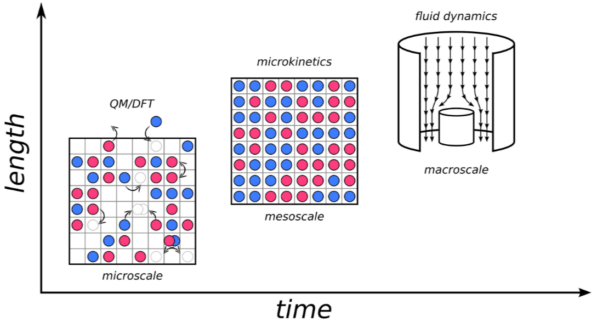
>
> 图1：多相催化多尺度方法中涉及的三个尺度的示意图以及相应的模型和方法
> 
> （左下）微观尺度（长度约为 nm，时间约为 ns）。催化剂表面的示意性俯视图以草图的形式显示了化学物质的吸附和解吸、扩散或反应事件等基本过程，涉及到在活性位点方形晶格上的运动。
> 
> （中）介观尺度（长度约为 μm，时间约为 ms）。微动力学模拟评估了微观尺度上所有基本过程的相互作用，以获得表面成分（如表面物种对催化剂表面的覆盖情况）和固有催化活性的信息。
> 
> （右上）宏观尺度（长度约为 m，时间约为分钟/小时）。反应器中流体流动的图示，其中由微动力学模型确定的固有催化活性通过作为描述催化剂表面的有限元的边界条件整合到宏观模型。

现在再“缩小”一点，进入介观尺度，可以看到，发生的事情是上述基本过程以及与周围环境相互作用的复杂相互作用的结果。在这里，界面处的时空演化由集体行为主导，热力学开始发挥作用。在这个阶段，人们可以利用微观信息（例如，基本过程的反应势垒、吸附能等），并将其作为粗粒化的一种形式嵌入到微观动力学模型中。从 Sabatier 分析到平均场模型和 kMC，有许多不同复杂度的方法可供选择。最后，在宏观尺度上，需要考虑反应器几何形状中的传输现象以及质量和温度梯度。这是一个目前主要由连续流体动力学模型覆盖的领域`（Janardhanan和Deutsch mann，2011）`。在这个阶段，再次可以嵌入来自较低尺度的信息，即在这里，微动力学模型的结果被整合为输入，例如以描述流动现象的微分方程的边界条件的形式`（Matera和Reuter，2010；Matera等人，2014）`。开发适当的分层级模型来有效地描述这些不同尺度上的事件，更重要的是开发“桥梁”在它们之间传递信息，这是现代多尺度建模方法的核心`（Raimondeau和Vlachos，2002；Reuter等人，2005；Vlachus，2012）`。

在化学和材料科学的许多其他领域，已经或正在开发类似的多尺度方法。微动力学模型，尤其是 kMC 模拟，通常是用于在要描述的介观性质超出热力学平衡时，捕捉基本过程之间相互作用的统计方法。除了催化作用，在表面或界面同样值得注意的应用领域是扩散和晶体生长。在这些领域对 kMC 模拟的使用，我们将在下面集中讨论。然而，本文并不打算作为对基本方法的阐述。为此，读者可以参考许多优秀论文`（Chatterjee和Vlachos，2007；Voter，2007；Reuter，2011；Stamatakis和Vlachus，2012；Stamatakes，2014）`。相反，本文想提供的是如何进行此类模拟的实用指南（特别是在表面反应 kMC 的背景下），特别强调最佳实践建议以及对当前挑战和观点的讨论。

## 2. kMC仿真：从理论到代码

### 2.1. 小概率事件的动力学：是瓶颈，也是答案

固体表面涉及的许多基本过程表现出很高的活化势垒（即使由于催化剂的存在，势垒可能会降低），这些势垒通常比 $k_BT$ 大得多，因此，如果只有热能驱动，相应的过程就被归类为罕见事件。虽然单个原子的运动（例如它们的振动，以及实际的反应事件，即系统达到过渡态越过激活势垒）发生在皮秒时间尺度上，但连续的高势垒事件之间的时间可能会长很多数量级，可能需要长达几秒或更长时间的模拟，以便就多个可能的基本过程集合中的相互作用的影响得出有意义的结论。在这些罕见事件之间的长时间跨度内，系统的“生命”充满了围绕 PES 上单个极小值的振动。向其他稳定状态（即PES盆地）的转变只是偶尔发生。因此，在介观时间尺度上，系统的时间演化表现为一系列从一个状态到另一个状态的连续跳跃（见图2）。此外，可以直观地假设，系统在一个盆地中花费的时间越长，它就越“忘记”它是如何到达那里的。一段时间后，每种可能的逃离盆地的方式都变得完全独立于进入盆地之前的整个历史。换句话说，系统态与态之间的跳跃构成了所谓的马尔可夫链`（van Kampen，2007）`。

> 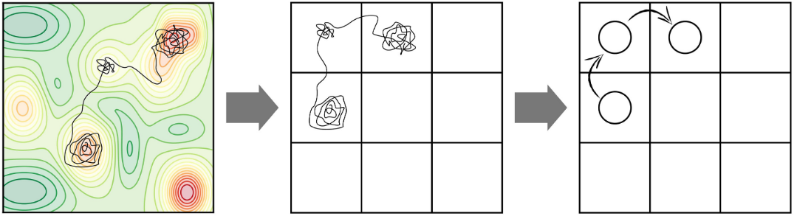
>
> 图2：将分子动力学（MD）轨迹粗粒度化为马尔可夫链
> 
> （左）可能的MD轨迹（黑色）覆盖在系统潜在的势能面（PES）上，红色区域代表低能盆地。在这些 PES 盆地中，大部分时间都花在围绕各自最小值的振动运动上。在某个时刻，系统会找到一条通往下一个盆地的路线。
> 
> （中）将 PES 最小值粗粒化到适当定义的晶格上的位置。每个格子位置代表 PES 最小值的吸引盆地。
> 
> （右）将连续 MD 轨迹粗粒度化为盆地/晶格位置之间离散跳跃的马尔可夫链。

因此，系统在时间$t$实际处于状态$i$的概率 $P_i(t)$ 的变化仅取决于从当前状态$i$跳到任何其他状态$j$的概率，以及从任何其他状态$j$跳到状态$i$的概率。在目前的化学动力学背景下，这些跳跃概率表示为单位为 $t^{-1}$ 的基本过程的速率常数。因此，$P_i(t)$ 的整体变化由一个简单的平衡方程控制，称为马尔可夫主方程：

$$ \frac{dP_i(t)}{dt} = -\sum_{j\neq i} k_{ij} P_i(t) + \sum_{j\neq i} k_{ji} P_j(t) \tag{1} $$

从数学的角度来看，方程(1)是一个耦合的微分速率方程组。看似简单，但不幸的是，很快就无法明确求解表面催化（或扩散或生长）中通常涉及的可能状态的数量。为了粗略估计，让我们考虑一个有100个表面位点的系统 [例如，在一个周期性边界条件单元中，每个边有10个原子的 fcc(100) 面]。在 kMC 模拟简单催化反应 $A + B \rightarrow AB$ 的过程中，每个位点可以假设有3种可能的占据状态：空的、被物种A占据、被物种B占据（假设形成的产物AB立即解吸到气相中）。这样一个微不足道的玩具模型的可能状态数量已经达到 $3^{100}$，因此，包含系统状态之间所有可能速率常数的矩阵kij将具有 $(3^{100})^2 \approx 2.66\times10^{95}$ 个元素，这使得它甚至不可能进行存储，更不用说它的对角化了，甚至考虑到可访问状态的有限数量使其在很大程度上是稀疏的。

作为摆脱这种混乱的一种巧妙方法，kMC 背后的实用蒙特卡洛式思想是，永远不要试图处理整个矩阵，而是生成随机轨迹，将系统从一个状态传播到另一个状态。由此，概率 $P_i(t)$ 的正确时间演化可以通过在这些轨迹上进行系综平均来获得，或者，如果系统处于稳态并且确保了遍历性，则可以通过在一个足够长的单个轨迹上进行时间平均来获得。因此，kMC 方法用基于随机动力学的数值方法代替了方程(1)的解析解。使这项工作“唯一”需要的是一种生成合适轨迹的算法，这些轨迹（一旦生成或时间平均后）会产生正确的概率 $P_i(t)$。因此，该算法需要在沿着这种状态到状态轨迹的每一步确定系统下一步应该跳跃到哪个状态，以及在什么时间步之后应该发生下一次跳跃。kMC 算法通过根据速率常数选择基本过程，然后更新时间来实现这一点。我们将在第3节中回到这些算法细节。

### 2.2. 将问题映射到晶格上

在实践中应用 kMC 的挑战在很大程度上与 PESs 上过多的极小值有关，更重要的是，连接它们的基本过程数量更多`（Margraf和Reuter，2019）`。在最初绘制的多尺度视图中，希望对所有这些过程采用根据第一性原理计算的速率常数，以建立有预测能力的模型。如果考虑到每个速率常数计算原则上都需要确定过渡态以获得活化势垒（见下文），那么在 kMC 轨迹的每一步都需要大量这种第一性原理速率常数的计算，这种“暴力 kMC”方法在目前和可预见的未来通常都是不可行的。目前有许多途径可以克服这一阻碍，一个明显的补救措施是重复使用在之前的 kMC 轨迹步骤中已经计算过的第一性原理速率常数，从而建立一个不断增加的数据库。在实践中，这需要一个明确的识别方案，该方案识别当前 kMC 步骤中可能的基本过程与之前步骤中发生的过程是否相同。另一种可能是降低速率常数计算的要求。这可以通过诉诸较低层次的理论来实现，比如使用适当的原子间势而不是 DFT，或者使用更近似的活化势垒，例如通过 Brønsted-Evans-Polanyi(BEP) 关系计算（见下文），从而避免昂贵的过渡态测定。这里的关键问题始终是某个方案是否有足够的准确性来保持所需的预测能力。在模拟表面催化中尤其需要注意，因为催化活性和选择性对活化势垒的微小变化高度敏感。最后，人们可以选择性地只考虑所有可能的基本过程中一部分，例如在催化中，只关注某些反应机制。如果这些考虑是基于可靠的见解（例如，来自实验证据或其他模拟），这可能会非常优雅。这里的关键在于，kMC 模拟经常被精确地用来找出所有可能的基本过程中，哪些过程在统计相互作用中起着至关重要的作用。换句话说，kMC 的目标是识别过程空间的重要部分，而不是首先假设它们。

在这种情况下，一种普遍的 kMC 实现方法是利用所研究系统的晶体有序性来解决问题。在这种有序性下，可以将相关的 PES 极小值映射到某种适当的周期性晶格上。例如，在表面催化的 kMC 模拟中，不同系统状态的区别仅在于它们在各种晶格位置上吸附物的分布。这种类型的 kMC 被称为晶格 kMC。让我们以表面过程的一个简单例子来说明这个概念，比如在 fcc(100) 表面上的一个原子的扩散。如果稳定的 PES 最小值对应于四重空位点，我们可以立即建立一个晶格模型，其中只包括允许原子从一个空位点开始并最终到达另一个空位点的扩散过程。对于系统的每个状态，通常需要弛豫几何结构，原子在弛豫后可能不会完全位于晶格位置上。然而，必须选择原子至少在放松后足够接近晶格的位置，以便可以明确地分配到一个晶格点。这已经显著减少了（并确保了）可能过程的数量，尽管这个数量仍然相当大。

利用晶格的平移对称性可以进一步减少所需速率常数的数量。让我们首先假设在我们的扩散系统中只有一个吸附原子。晶格的平移对称性告诉我们，任何吸附位点的基本过程都是相同的。一旦我们计算了这些过程的速率常数一次，我们就可以简单地将它们用于另一个吸附位点的基本过程。在我们的例子中，如果我们假设位点间的跳跃扩散是唯一可能的扩散机制，那么这意味着我们只需要计算一个单一的速率常数（对于这样的跳跃过程）。在这里，对称性是指晶格位置本身的对称性，因为（记住）我们在扩散示例中只考虑了一个吸附原子。如果我们有其他物种占据附近的晶格位置，这种对称性很容易被打破。在这种情况下，`Walter Kohn` 提出的化学相互作用的短视性是有帮助的，即假设与晶格上某些附近的物种的相互作用可能已经如此之小，以至于对速率常数几乎没有影响。如果我们越来越多地忽略邻近物种之间的这种影响，我们就可以恢复到基本过程的完全局部性，就像我们在孤立吸附原子的情况下所具有的那样简单和高对称性的情况。对于这个特定的例子，最局部的近似可能就是完全忽略与附近其他物种的任何相互作用——除了防止吸附原子在已经被占据的位置上发生扩散过程（所谓的位点阻塞）。尽管一个晶格上具有任意数量吸附原子的系统可能具有大量的可能配置，但仍然只需要一个单一的跳跃过程的速率常数。如果我们考虑一个（10×10）的晶格，那么方程(1)中的态-态矩阵仍然是$2^{100}$阶的。然而，它只包含值为零或具有这个单一速率常数的元素。更一般地说，平移（可能还有任何旋转）对称性并不会减少状态空间。然而，它可以显著减少需要计算的不相等速率常数的数量。

作为一个不太激进的近似，我们可以只考虑吸附物种与最近邻位点物种的横向相互作用。如图3所示，在我们的简单扩散示例中，我们需要计算五个不同的速率常数，每个速率常数对应四个最近邻位点的六种可能占用方式：完全没有占用1种，占用了一个相邻位点2种，占用了两个相邻位点2种，占据了三个相邻位点1种。讨论局部环境对速率常数的影响将有助于提高模拟的准确性（如果这种横向相互作用确实仍然不可忽视），但显然需要更多的速率常数计算。在实践中，考虑晶格上横向相互作用的逐步实现是通过簇扩展技术进行的，我们将在第9节中进一步讨论。从本质上讲，簇扩展允许在没有其他物种的情况下将给定基本过程的基本速率常数修改为具有相邻位点的任何分布的同一过程的速率常数。

> 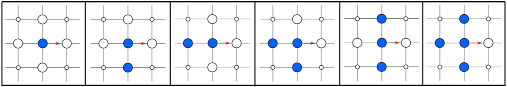
>
> 图3：粒子在二次晶格上的跳跃扩散过程（红色箭头），每张图显示了初始状态下最近邻晶格位点的所有可能情况。对称等效的情况只显示一次。粒子扩散到的位置必须是空的，才能进行该过程。

因此，在晶格近似中，可以扫描所有可能的配置和转换，预先计算局部配置的相关速率常数，并将其保存在所谓的速率目录中。在 kMC 运行期间，检查轨迹步骤的当前配置，并从速率目录中提取可能的过程及其速率常数。另一种方法是识别可能的过程，并在每个 kMC 步骤中仅实时计算对基本过程速率常数的簇扩展校正。当考虑到许多横向相互作用时，这种方法在数值上可能更有效，因为搜索综合的速率目录的成本变得很高。第9节将提供相关示例。

到目前为止，使用的近似可能非常有效，并且可能允许在模拟中使用非常大的超胞。然而，需要详细的 PES 信息，并假设晶格是有序的。如果晶格模型选择不当，可能会忽略 PES 的重要极小值。同时，由动力学过程引起的晶格的任何变化都无法通过构造来捕捉`（Reuter，2016）`。这包括反应诱导的表面重建、其他表面形态转变或插层扩散中负载诱导的晶格转变等重要方面。离晶格动力学蒙特卡洛（offlattice kMC）的目的正是克服这些限制，我们将在第5节中讨论如何处理随后的速率常数计算数量的问题。

### 2.3. 平均场近似（Mean Field Approximation）

使用 kMC 对主方程（方程1）进行数值求解的另一种方法是引入更多的近似值（在晶格近似的基础上），使方程更容易求解，甚至可以得到解析解。最常见的方法是平均场近似（MFA），它牺牲了扩展晶格上的详细空间分辨率，代之以晶格的任何位点上每个物种的平均覆盖率。从数学上讲，MFA 假设晶格上不同位点的占据在统计上是独立的，即晶格上不同位置之间没有相关性。从表面吸附层的观点来看，也就是吸附层是充分混合的。

让我们从某个基本过程的速率 $r_{ij}(t)$ 开始，它由下式给出:

$$ r_{ij}(t)=P_i(t) k_{ij} \tag{2} $$

首先，让我们只考虑一阶和二阶过程，即我们假设在一个基本过程中最多涉及两个晶格位点。根据定义，一阶过程不涉及超过一个晶格位点，即不相关晶格位点的假设自然成立。作为二阶过程的一个例子，我们考虑两个邻近物种$A$和$B$的反应。我们将用 $P_{ab}(A,B,t)$ 表示在时间$t$时在位点$a$找到物种$A$，同时在邻近位点$b$找到物种$B$的（时间依赖的）概率。在没有相关性的情况下，并且假设晶格上物种的分布在空间上是同质的，我们可以把这个概率写成一个简单的乘积：

$$ P_{ab}(A,B,t)=\Theta_a(A,t) \Theta_b(B,t) \tag{3} $$

其中 $\Theta_a(A,t)$ 和 $\Theta_b(B,t)$ 分别是物种$A$在$a$位点和物种$B$在$b$位点的（时间依赖性）空间平均覆盖率。将其推广到任何反应级数，MFA 由此将高维主方程压缩为更简单的速率方程形式：

$$ r_{ij}(t)=N_{ij} k_{ij} \prod_{a \isin i} \Theta_a(A,t) \tag{4} $$

其中 $N_{ij}$ 是考虑初态$i$和终态$j$中涉及的位点的连接性的几何因子，并且物种$A$在初态$i$中占据位点$a$`（Matera等人，2011）`。

由此，MFA 产生了一组耦合的微分方程，这些方程可以通过标准算法求解`（Medford等人，2015）`。在催化中，这通常与关于决速步的某些假设相结合（见第7节），甚至得出反应速率的解析解。虽然这些近似和 MFA 近似本身极大地简化了问题，但人们应该始终记住，它们终究是近似值。特别是，MFA 通常只在无限快扩散和完全没有横向相互作用的情况下适用。我们将在第8节中回到这一点。MFA 模型所需的第一性原理输入与 kMC 模型基本相同，即所有可能的过程及其相关的速率常数。然而，由于 MFA 模型固有的无限快扩散的假设，不需要明确计算相同类型位点之间的扩散势垒。

### 2.4. 现有代码

尽管特别是在表面催化的背景下，MFA 微动力学模型仍然很普遍，但人们可以清楚地看到 kMC 模拟的趋势。人们常说，一种新的仿真技术的成熟度可以通过用户友好的通用软件包的出现来判断（甚至可能提供 GUI）。如果从表面上看这种观点，kMC 在过去几年中确实已显著成熟，在极短的时间内出现了许多高端的软件包。参考`Stamatakis（2014）`对此类软件包的更详细描述，我们在这里只简要介绍一些，以提供目前可用的印象：

Lukkien 等人在代码 CARLOS 中提供了首批通用 kMC 实现之一`（Gelten等人，1998）`。在 CARLOS 中，可以指定任何类型的反应作为输入，然后程序使用模式识别来识别可能的反应。CARLOS 还实现了随时间变化的速率常数。

`Slepoy 等人（2008）`开发的 SPPARKS 实现了多个 kMC 求解器，并采用模块化结构，以满足新模型和求解器的扩展和实现。目前实现的模型包括晶格和非晶格应用，以及用于模拟生化反应网络的通用模型。

`Stamatakis和Vlachos（2011）`开发了一种方法，该方法采用图论思想来克服每个参与物种占据单个位点以及基本事件最多涉及两个位点的限制性假设。在这里，晶格结构和基本事件被表示为图，晶格过程是通过在模拟过程中解决子图同构问题来识别的。在此基础上，`Nielsen等人（2013）`开发了 ZACROS，该代码结合了簇扩展哈密顿量，以准确解释长程横向相互作用。这两种方法适用于处理具有相当复杂的表面化学的系统，包括有机吸附层和反应物可能在多个位点吸附的情况。

最近开发的 MonteCoffee`（Jørgensen和Grönbeck，2018）`利用了与图论方法类似的思想，旨在模拟纳米粒子。该代码使用邻居列表来表示位点连接，而不是将问题映射到网格上。就图论方法而言，用户可以直接控制位点的连接。

Adaptive kMC（aKMC）方法主要由 Henkelmann 及其同事开发`（Henkelman和Jónsson，2001；Xu和Henkelman，2008）`。软件包 EON 目前包括一组模拟中尺度动力学的算法（并行复制动力学、超动力学、盆地跳跃以及 aKMC）。对于 aKMC，该代码实现了一个服务器-客户端架构，其中客户端进程负责鞍点搜索（见第4节）以逃离当前盆地，然后将计算出的速率报告给执行 kMC 算法的服务器。

kmos`（Hoffmann等人，2014）`是一个基于 API 的 kMC 框架，它有助于在 Python2 中生成抽象的模型定义，然后自动生成高效的 Fortran 代码。该代码由 Max Hoffmann 发起，主要由我们团队（本文的作者）开发。我们将在后面的部分中使用它进行实践示例，详细介绍如何运行 kMC 模拟。在下一节中，我们将进一步描述基于 kmos 的 kMC 算法，作为当今代码的一个例子，同时我们强调不同的代码可能会用不同的算法来求解主方程。[译者注：kmos 框架基于 Python2，后续开发团队将其更新到了 Python3，称为 kmcos。]

## 3. 更实用一点：算法与输入数据

如上所述，kMC 的精髓是 kMC 算法，该算法生成随机轨迹，适当的平均后产生主方程(1)中概率 $P_i(t)$ 的时间演化。最常用的 kMC 算法之一，最初由`Bortz等人（1975）`为 Ising 自旋系统开发，被称为 BKL 算法（以作者的名字命名）或“n折法”。它也被称为可变步长法`（Jansen，1995）`或直接法`（Gillespie，1976）`。为了对算法进行简单、实用的合理化，让我们考虑一个简单的示例系统，假设该系统只有两个可能的状态$A$和$B$，只由一个势垒连接，具有正向和逆向的速率常数 $k_{AB}$ 和 $k_{BA}$。在这个系统中，只有两个基本事件是可能的：例如，如果系统处于状态$A$，它只可能跳到状态$B$。由于此跳的速率常数为 $k_{AB}$（单位为 $t^{-1}$），人们可能会简单地认为，发生此跳跃之前等待的平均时间为 $\tau_{AB}=k_{AB}^{-1}$。显然，对于从状态B跳回状态A，平均等待时间将为 $\tau_{BA}=k_{BA}^{-1}$。因此，kMC 算法将生成一个轨迹，在每个跳跃后，时间都将增加 $\tau_{AB}$ 或 $\tau_{BA}$（取决于发生了什么跳跃）。

从数学上讲，这种简单的想法并不完全正确。实际上，当系统处于状态$A$时，每经过一个短暂的时间增量，系统找到逃逸路径的概率是相同的。这产生了一个指数衰减的生存统计，其导数代表了首次逃逸的真实时间的概率分布 $p_{AB}$：

$$ p_{AB}(t)=k_{AB} \exp(-k_{AB}t) \tag{5} $$

因此，平均逃逸时间必须由泊松分布适当加权。可以证明`（Gillespie，1976；Fichthorn和Weinberg，1991）`，这是通过将系统时钟推进到

$$ \Delta t_{AB}=-\frac{\ln(\rho_2)}{k_{AB}}  \tag{6} $$

来实现的。在这里，$\rho_2 \isin [0,1]$ 是满足特定分布的一个随机数。

当我们现在将其推广到任意系统时，在 kMC 轨迹的每一步，从当前状态$i$到其他状态$j$的多个过程 $i\rightarrow j$ 都是可能的，泊松过程理论允许直接推导出直到任何过程发生为止的平均时间。由于基本过程是独立的，因此每个过程都有自己的概率分布$p_{ij}$，由下式给出：

$$ p_{ij}(t)=k_{ij} \exp(-k_{ij}t) \tag{7} $$

过程 $i\rightarrow j$ 中的任何一个从状态$i$首次逃逸时间的概率分布为：

$$ p_{escape}(t)=k_{tot} \exp(-k_{tot}t) \tag{8} $$

其中

$$ k_{tot}=\sum_{j} k_{ij} \tag{9} $$

是作为所有单个基本速率常数之和获得的总逃逸速率常数。与单过程情况一样，平均逃逸时间为：

$$ \Delta t_{escape} = -\frac{\ln(\rho_2)}{k_{tot}} \tag{10} $$

要特别强调的是，这个逃逸时间只取决于总速率常数，与实际发生的使系统脱离当前状态$i$的过程无关。然而，这个实际过程需要被识别，因为这决定了系统传播到哪个状态$j$。然后，该状态$j$是下一个 kMC 步骤的起点，即下一个 kMC 步骤评估从该特定状态$j$的逃逸事件。

BKL 算法通过随机算法再次从所有可能的过程中确定这个已执行的过程。请想象有一堆与可能过程的速率常数 $k_{ij}$ 成比例高的柱状图，相应地，总高度为 $k_{tot}$。我们可以从柱状图的这些列中选择一个过程来执行，方法是生成一个随机数 $\rho_1$ 并将其乘以 $k_{tot}$。结果数字将“指向”过程堆栈中具有正确概率的过程，如图4所示。然后执行所选的过程，使我们的系统在下一个 kMC 步骤中转移到不同的状态。这种从堆栈中选择的方式确保了以比慢速过程更高的概率选择更快的过程：它们具有更大的速率常数，在堆栈中相应地具有更高的段，并且相应地被更频繁地选择。因此，我们有一个方式来生成满足主方程的轨迹，该轨迹是仅通过获取两个随机数 $\rho_1, \rho_2 \isin [0,1]$ 来获得的。因此，一个重要的参数是用于生成随机数序列的随机数种子，因为用新的种子值重新计算轨迹将导致统计上独立于前者的新轨迹。

如图4所示，该算法可以总结如下：

- 列出系统逃离当前状态$i$的所有可能过程$p$，以及相应的速率常数$k_p$；
- 生成两个随机数 $\rho_1, \rho_2 \isin [0,1]$；
- 计算 $k_{tot}= \sum_{p} k_p$；
- 抽取过程$q$，必须满足约束 $\sum_{p=1}^{q} k_p \geq \rho_1 \geq \sum_{p=1}^{q-1} k_p$；
- 执行随机抽取到的过程；
- 更新系统时间：$t \rightarrow t -\ln(\rho_2)/k_{tot}$ .

> 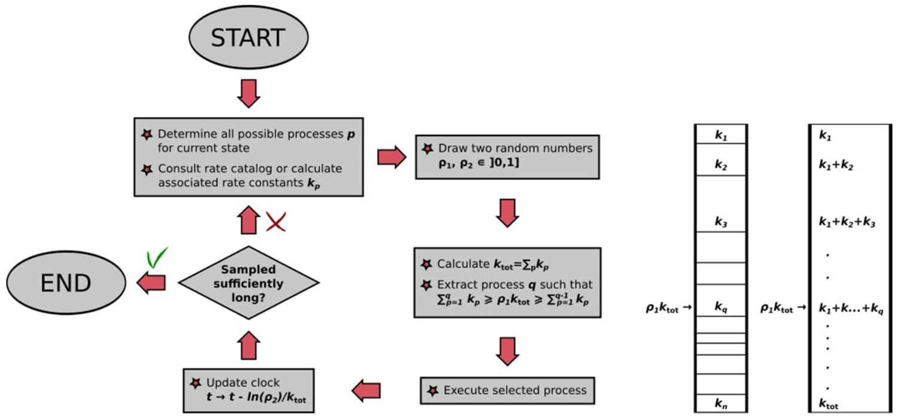
>
> 图4：（左）在 kmos 中实现的 BKL 算法的流程图。（右）过程堆栈中随机选择过程的示意图。

## 4. 从第一性原理到速率常数：过渡态理论（Transition State Theory）

如前几节所述，kMC 需要所有基本过程的速率常数作为输入。对于这里关注的表面反应，这些速率常数目前主要是通过过渡态理论（TST）获得的。让我们做出一些假设，例如，通过从$i$到$j$的过渡态（TS）的轨迹通量永远不会返回到状态$i$，即所谓的 No-recrossing Rule；此外，假设势垒跨越是一个纯粹的经典事件（没有量子隧穿），TST 为速率常数提供了一个简单的表达式，称为 Eyring（或 Eyring-Polanyi）方程：`（Laidler，1987））` [译者注：读者可能可以注意到它和著名的 Arrhenius 方程之间的微妙联系。]

$$ k_{ij}^{{TST}}=\frac{q_{{TS}}^{{vib}}}{q_{i}^{{vib}}}\frac{k_{{B}}T}{h}\exp\left(-\frac{\Delta E_{ij}}{k_{{B}}T}\right)=k_{o}\frac{k_{{B}}T}{h}\exp\left(-\frac{\Delta E_{ij}}{k_{{B}}T}\right) \tag{11} $$

其中$T$是绝对温度，$h$是普朗克常数，$q_{TS}^{vib}$ 和 $q_i^{vib}$ 分别是过渡态和初始态的配分函数，$\Delta E_{ij}$ 是该过程的活化势垒。后者可以直接从 PES 信息中获得，因此可以进行第一性原理计算（例如半局部 DFT）。原则上指前因子 $k_{o}\frac{k_{B}T}{h}$ 也是可以计算的。最受欢迎的是谐波 TST，其中配分函数是从初始状态$i$和 TS 的振动模式中获得的。然而，在大多数研究中，避免了这些计算成本相当大的振动计算，而是使用一个简单地近似，认为 $k_o \approx 1\sim 10$，也即 $10^{12}\sim 10^{13} s^{−1}$ 范围内的指前因子。只有当 TS 的振动特性与初始状态的振动特性相差不大时，这种做法才是真正合理的。非活化吸附过程是这一常见近似不成立的一类突出过程，在这一过程中，指前因子需要考虑从气相到表面结合态的强烈熵减。在这种情况下，速率常数最好估计为：`（Reuter和Scheffler，2006；Chorkendorff和Niemantsverdriet，2017）`

$$ k_{n,B}^{{ads}}(T,p_{n})=\widetilde{S}_{n,B}(T)\frac{p_{n}A_{uc}}{\sqrt{2\pi m_{n}k_{{{B}}}T}} \tag{12} $$

其中，$pn$ 是质量为 $m$ 的物质 $n$ 的分压，而局部黏附系数 $\widetilde{S}_{n,B}(T)$ 决定了撞击到面积为 $A_{uc}$ 的表面位点中的位置 $B$ 上的粒子中，发生黏附的分数。

### 4.1. 主方程和细致平衡（Detailed Balance）

接下来，我们将介绍微动力学模型（kMC 或 MFA）的输入（过程和速率常数）都必须遵守的一些实用准则。让我们考虑一个已达到稳定状态的系统。这就要求主方程(1)中的导数必须消失，从而得出以下条件：

$$ \sum_{j\neq i}\left[k_{ij}P_i^*-k_{ji}P_j^*\right]=0 \tag{13} $$

其中 $P_i^∗ (P_j^∗)$ 是系统处于状态 $i (j)$ 的与时间无关的概率。这个条件是一个守恒定律，说明离开任何状态 $i (j)$ 的所有转变速率之和必须等于进入状态 $i (j)$ 的所有转变速率之和。在热力学平衡状态下，微观可逆性和细致平衡原理`（Tolman，1925）`提出了更强的约束条件，即每个微观过程的平均速率必须与其逆过程完全平衡：

$$ \frac{k_{ij}}{k_{ji}} = \frac{P_j^*}{P_i^*} \tag{14} $$

因此，等式(14)的右侧与状态的玻尔兹曼权重成正比，可以用状态 $i$ 和状态 $j$ 之间的自由能差表示：

$$ \frac{k_{ij}}{k_{ji}} = \exp(-\frac{F_j(T)-F_i(T)}{k_B T}) \tag{15} $$

上述推导为构建 kMC（或 MFA）模型提供了两条实用准则。第一条准则是每个微观过程都必须定义一个相应的反向过程，第二条准则是正向过程和反向过程的速率常数表达式必须符合式(15)。

对于后一点来说，尤其重要的是要认识到，计算 $F_i$ 和 $F_j$ 两种状态的自由能应该用同样的近似法。在实践中，这一点往往被忽略（不同的超胞/配置、第一性原理和经验数据混合等），并可能产生严重后果，因为动力学模型在热力学上并不一致`（Schmitz，2000；Mhadeshwar 等人，2003）`。因此，相当多的工作致力于实现整体热力学一致性，如`Mhadeshwar 等人（2003）`和`Nielsen 等人（2013 年）`。

### 4.2. 获取速率常数：过渡态搜索（Transition State Search）

在确定速率常数的过程中，一个自然的想法是将主要注意力放在需要克服的最低活化势垒上，例如，在催化反应中，将注意力放在连接反应物和生成物的最小能量路径上。从数学的角度来看，找到最低活化势垒就等于找到了 PES 上的最低一阶鞍点，这是一项特别具有挑战性的任务，与找到 PES 最小值相比，目前还没有一种通用的方法可以保证成功。下面我们将简要讨论现有各种方法的可靠性、准确性和性能。尽管我们始终牢记“因人而异”，但还是可以根据当前问题的性质，确定哪种方法更可取。对于晶格 kMC，我们可以假定或推导出机理（如异相催化反应机理），然后编制一份构成该机理的基本过程列表。在这种情况下，初始状态和最终状态是预先确定的，因此可以使用所谓的插值法。对于自适应 kMC 而言，通常不会预先假定机制，因此可能需要盲目地探索从当前状态逃逸的可能和最有可能的路径。由于只能获得初始状态的信息，因此必须使用所谓的局部方法。

#### 4.2.1. 插值方法

基于插值的 TS 搜索的最简单形式是在一个或少数几个内部自由度中猜测反应坐标，优先选择那些描述初始状态和最终状态之间主要结构差异的坐标。选定的坐标随后会被限制在初始和最终结构之间的特定值上，同时对所有其余自由度进行优化。这种 TS 搜索通常被称为坐标驱动（拖曳）方法`（Halgren 和 Lipscomb，1977；Rothman 和 Lohr，1980；Williams 和 Maggiora，1982）`。拖曳方法的成功与否主要取决于能否选择一组好的反应坐标，以及 PES 在剩余自由度方向上的拓扑结构。一般来说，如果反应路径仅由一个或两个自由度主导，那么坐标驱动可能会奏效，受约束的优化几何体（残余梯度最小）是 TS 的良好近似值。另一方面，如果反应变量选择不当，可能会导致迟滞，并收敛到（非物理的）不连续反应路径`（Halgren 和 Lipscomb，1977；Henkelman 等人，2002）`。

拖曳方法每次只对一个结构进行操作。通过同时优化反应路径初始猜测的多个点，可以实现显著的改进。一个例子是脊法`（Ionova 和 Carter，1993）`，该方法通过同时放松 PES 脊线上稍有偏移的两个 TS 复制品来迭代改进 TS 的初始猜测，直到它们收缩到实际的 TS。使用两个以上结构的方法通常被称为“状态链”方法。结构的初始分布通常是沿着初始和最终之间的坐标线性插值，或沿着所选反应路径的任何方便的连续变化形式。然后以某种协同方式同时优化所有中间状态或图像，不仅提供鞍点，而且提供整个反应路径的良好近似值。

在这些方法中，微动弹性带（Nudged Elastic Band, NEB）方法`（Jónsson 等人，1998；Henkelman 和 Jónsson，2000）`可以说是最流行的，因为它吸收了以往方法的长处，弥补了它们的不足。在初始化初始图像链 $R_i$ 后，NEB 将目标函数（“弹性带”）最小化，该函数定义为所有中间图像的能量总和，以及通过一个弹性系数 $k$ 计算的分布路径上各点的附加惩罚项（见图 5）：

$$ S_{{\mathrm{EB}}}(\mathbf{R}_{1},\ldots,\mathbf{R}_{N})=\sum_{i=1}^{N}E(\mathbf{R}_{i})+\sum_{i=1}^{N-1}\frac{1}{2}k(\mathbf{R}_{i+1}-\mathbf{R}_{i})^{2} \tag{16} $$

> 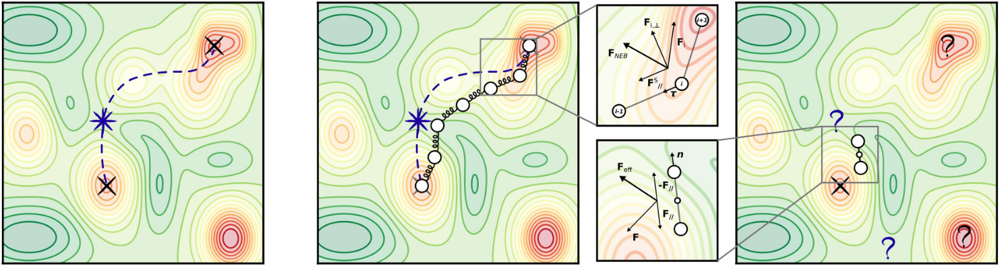
>
> 图5：过渡状态和最常用的过渡态搜索方法。
> 
>（左）一个任意的 PES 呈现多个极小值（用红色表示）。黑色十字标记两个局部极小值，例如已知基本反应的初始状态（IS）和最终状态（FS）。紫色星形标记为 TS 的位置；紫色虚线代表连接 IS 和 FS 的最小能量路径。
>
>（中）NEB 方法图解。放大图显示了力的组成，它决定了在某一优化步骤中作用于图像 $i$ 的有效 NEB 力。
>
>（右）二聚体方法图解。放大图显示了在某一优化步骤中，在对方向进行约束最小化后，作用在二聚体上的有效力的组成。

一般来说，如果弹性系数 $k$ 过大，直接最小化 $S_{EB}$ 会表现出“切角”倾向；如果 $k$ 过小，则会向极值“下滑”（从而对实际 TS 区域采样不足）。这些问题可以通过“微动”弹性带来缓解，即只使用与路径切线平行的弹簧力分量（解决切角问题），以及只使用能量力的垂直分量（解决向下滑问题）。因此，作用在每个图像上的总力为：

$$ \mathbf{F}_{i,\mathrm{NEB}}=\mathbf{F}_{i\parallel}^s-\mathbf{F}_\perp^i=k\left(|\mathbf{R}_{i+1}-\mathbf{R}_i| - |\mathbf{R}_i-\mathbf{R}_{i-1}|\right)\hat{\tau}_i-\nabla E(\mathbf{R}_i)_\perp \tag{17} $$

其中 $\hat{\tau}_i$ 是图像 $i$ 处的单位切向量。在攀登图像 NEB（Climbing-Image NEB, CINEB）`（Henkelman 等人，2000）`变体中，经过几次迭代后会选择能量最高的图像，并通过关闭其弹性力和反转与链平行的势能分量，将其推向鞍点。这样就能精确地得到鞍点（在传统 NEB 中，鞍点是通过插值得到的），而不需要额外的计算成本。

当处理 PES 时，如果能量沿反应路径变化很大，而垂直于反应路径的变化很小，这时 NEB 方法仍有可能遇到麻烦。关于这个问题，有人指出，对于 CI-NEB 来说，切角并不会影响 TS 的准确性，并且如果使用全弹性力而不是只有平行分量，可能实现更稳定的向 TS 的收敛`（Kolsbjerg 等人，2016）`。此外，与所有同类算法一样，NEB 的计算成本也很高，因为它涉及许多结构的优化，通常需要大量的迭代。必须事先明智地选择图像数量和弹性系数值等参数。图像数量可能会对优化效率产生重要影响：数值过小会导致反应路径的覆盖范围不稳定，而数值过大则会将精力集中在点的分布上而不是寻找反应路径上，从而减慢收敛速度。在传统的 NEB 方法中，图像的数量在模拟过程中是固定的，因此要在充分覆盖反应路径和计算成本之间达成良好的折中是很有挑战性的。为了缓解这一问题，有学者提出了一种自动 NEB（AutoNEB）算法`（Kolsbjerg 等人，2016）`，该算法可以先集中收敛粗略路径，然后再提高 TS 周围的分辨率，从而节省计算资源。基于截断的能量加权弦方法（Truncation-based Energy Weighting String Method）`（Carilli 等人，2015）`提出了解决该问题的另一种方案，该方法利用能量加权将计算工作集中在势垒区域内物理上有趣的图像上。最后，值得一提的还有增长弦法（Growing String Method, GSM）`（Peters 等人，2004）`，该方法通过分别演化两个弦片段（一个与反应物相关，另一个与生成物相关）来规避对反应路径初始猜测的需求，直到片段收敛并由此定义反应路径。将 GSM 与特征向量跟踪 TS 搜索相结合的方法`（Zimmerman，2013）`，在100多个基本反应的基准测试（benchmark）上取得了很好的结果。

#### 4.2.2. 局域方法

考虑到过渡态是梯度消失的点，原则上可以通过最小化梯度法来定位过渡态。这正是所谓的局部方法的工作原理。与插值方法不同的是，局部方法只使用 PES 函数及其在每个点的一阶导数（也可能是二阶导数）的信息，也就是说，它们不需要初态或终态的拓扑信息。不过，该方法通常需要对 TS 有一个很好的估计，并将其作为起始构型以便收敛，这是其主要局限之一。

Newton-Raphson（NR）方法是局部方法中最常见的一种，只要开始搜索时足够接近 TS，就能直接定位 TS。这里的“足够接近”指的是已经处于谐波区域，且 Hessian 矩阵恰好有一个负特征值。在这些条件下，计算 Hessian 矩阵并直接求二阶泰勒展开的逆，可以得到沿 TS 特征向量的能量最大化和沿所有其他方向的能量最小化的步骤，从而精确地收敛到 TS。NR 方法的主要缺点是需要生成和处理整个 Hessian 矩阵。

不过，对于鞍点优化来说，Hessian 矩阵的主要功能是提供能量最大化的方向（如果足够接近 TS，则为最低的上升方向）。二聚体方法`（Henkelman 和 Jónsson，1999）`可用于确定这一方向，而无需明确计算 Hessian 矩阵，它采用了两个对称位移的复制品，即所谓“二聚体”（见图5），用来转换力，从而使优化在鞍点收敛，而不是在最小值收敛。一般来说，二聚体方法的策略是在最小值附近尝试多种不同的初始配置，通常从短时高温 MD 轨迹的极值中选取，以找到能走出该盆地的鞍点。第一步，通过施加图像之间的约束距离，使二聚体的取向最小化。最低模式方向由连接两个图像的线给出，可用于移动中心结构，即平移二聚体，然后再进行新的二聚体优化，如此循环。作用在二聚体中心的力会通过反转二聚体方向上的分量而发生改变：该力的最小化会将二聚体推向鞍点。二聚体优化只需使用一阶导数即可完成，因此无需计算 Hessian 矩阵。然而，性能与系统规模的比例关系尚不清楚。尤其不清楚的是，优化每个二聚体配置所增加的计算成本最终是否会超过不需要显式计算 Hessian 矩阵所节省的成本。

#### 4.2.3. BEP 和 标度关系（Scaling Relations）

采用近似能量关系提供了一种确定激活势垒的替代方法，该方法仍然保留了第一性原理的依据。最突出的例子是 Brønsted-Evans-Polanyi(BEP) 关系`（Nørskov等人，2002；Michaelides等人，2003）`，它指出如下的线性关系：

$$ \Delta E \simeq c_1\left(E_{FS}-E_{IS}\right)+c_2 \tag{18} $$

其中 $c_1$ 和 $c_2$ 是常数并且 $E_{FS}$ 和 $E{IS}$ 分别是终态和初态的总能量。后者可以从局部几何弛豫中获得，因此甚至比 TS 搜索便宜得多。两个参数 $c_1$ 和 $c_2$ 需要通过线性拟合到适当的第一性原理计算来确定。这些参数通常只能移植到与拟合所使用的类似的位点类型，例如过渡金属表面的 fcc(111) 位点，但它们在不同类型的反应中可能相当普遍`（Wang等人，2011）`。

此外，已经表明，许多反应物、产物和中间体在过渡金属表面的结合能与分子通常与表面结合的少数基本元素（主要是 C、N、O、S、卤素）的结合能相关`（Abild Pedersen等人，2007）`。使用这种标度关系，结合 BEP 关系，可以大大降低催化剂筛选等应用的第一性原理速率常数的计算成本，在这些应用中，必须为“类似”的过程计算大量速率常数。

## 5. 垃圾进，垃圾出（Garbage In - Garbage Out）

与建模中一样，重要的是要意识到，从模型中做出的预测受到模型输入数据质量的限制，通常表现为垃圾进-垃圾出（GIGO）原则。kMC 模型的必要输入数据是可能的过程及其相关的速率常数。如上所述，在第一性原理 kMC模拟的背景下，其中速率常数由 DFT 或其他电子结构计算确定，目前这些输入数据通常是预先确定的。换句话说，kMC 模拟本身并没有确定哪些过程是重要的或应该考虑的，以及在何种精度下考虑，而是取决于一个固定的给定过程列表，这些过程的速率常数固有着基础 DFT 计算带来的典型不确定性。这种硬性设置导致 kMC 模拟结果对输入数据具有很高的灵敏度。

正如最初提到的，或多或少克服这种普遍的硬性输入数据设置的局限性的先进 kMC 方法是当前研究的一个长期追求的目标和主题。自动识别系统中相关过程的一种可能性是预先使用（加速的）MD方法，如超动力学（hyperdynamics）、温度加速动力学（temperature-accelerated dynamics）或复制交换动力学（replica-exchange dynamics）`（Voter等人，2002）`。在自适应 kMC 中，使用二聚体方法或高温 MD 模拟的过程搜索直接集成到 kMC 算法中`（Henkelman和Jónsson，2001；Chill和Henkelman，2014）`。后一种方法的一大优点是，kMC 模型不一定必须在固定的晶格上实现。然而，它们通常在计算上也要求更高，因为它们需要更多数量级的能量和力的计算来确定所有过程及其势垒。因此，应用仅限于相当简单的系统或可以用经典力场而不是 DFT 进行能量和力的计算的系统`（Xu和Henkelman，2008；Konwar等人，2011；Pedersen等人，2015）`。至少目前，本文所涵盖的应用领域中的第一性原理 kMC 模拟实际上只有硬性设置才能处理，这就是为什么我们从现在开始在本实用指南中重点关注它。

在下文中，我们将使用 Au(100) 面上 Au 吸附原子扩散的简单模型来说明上述概念。这将突出可能的陷阱，为最佳实践提供指导。所有讨论的 kMC 模型都已在 kmos 软件包中实现`（Hoffmann等人，2014）`，并在补充数据中提供。[译者注：中文版由译者适配到了 kmcos 软件包中]

### 5.1. Au(100) 面上的吸附原子扩散

> 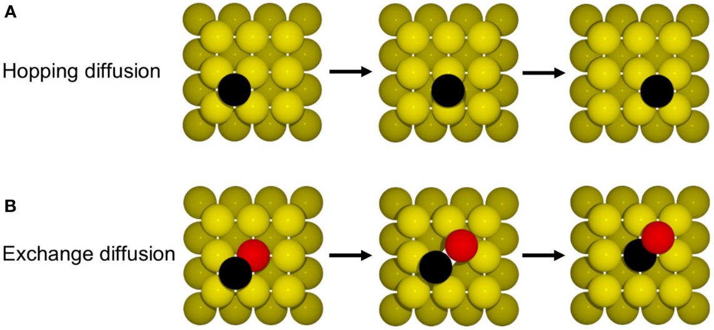
>
> 图6：（A）跳跃和（B）交换扩散机制的示意图。

在这个系统中，人们可以想到的最简单的扩散过程是 Au 原子在 Au(100) 表面晶格提供的4倍中空吸附位点之间跳跃（见图6A）[译者注：Au 的晶格类型为 fcc，其 (100) 面结构即如图6所示]。对于该系统的简单 kMC 模型，我们将考虑一个 $(20\times20)$ 晶格的吸附位点。可能的过程是粒子从一个位置跳到上、下、左、右四个相邻位置之一。忽略 Au 吸附原子之间任何可能的横向相互作用，这些过程的势垒都是相同的，在 DFT-LDA 水平上，计算出 $\Delta E_{diff}=0.83\ \mathrm{eV}$ `（Yu和Scheffler，1997）`。我们将使用 TST 表达式（式11）来表示扩散过程的速率常数。为了简单起见，我们将忽略对势垒的任何熵校正和零点振动能校正，即 $k_o=1$。为了运行 kMC 模型，我们需要用粒子填充一些晶格位点。如果我们用空晶格初始化模拟，我们将直接陷入死锁，无法进行任何过程。在这个例子中，我们通过随机填充 Au 吸附原子来制备初始状态，这些吸附原子具有单层（ML）0.25的覆盖率，即平均每四个表面位点就有一个被占据。作为模拟的输出，我们通过跟踪均方位移（MSD）`（Garhammer，2017）`作为时间的函数来计算 Au 吸附原子的扩散系数，然后，扩散系数 $D$ 可以计算为：

$$ D=\frac{\langle\mathrm{MSD}(t)-\mathrm{MSD}_0\rangle}{2dt} \tag{19} $$

其中 $t$ 是模拟时间，$d$ 是维数（在这种情况下为2），〈〉是指对所有 Au 原子进行系综平均。为了改进统计数据，运行了25个独立的模拟，这些模拟在晶格的随机初始化和使用的随机数种子方面不同。图7中的粉红色线显示了这25个模拟的平均值，从中确定扩散系数为 $0.0022\ nm^2/s$。

然而，这种跳跃扩散过程并不是金属表面自扩散的唯一可能机制。实验和理论上都描述了一种替代的交换扩散机制`（Bassett和Webber，1978；Wrigley和Ehrlich，1980；Feibelman，1990；Yu和Scheffler，1997）`，其中金属吸附原子取代表层原子并将其推到相邻的吸附位点（见图6B）。对于同一物种的吸附原子和表面原子，这也有效地导致了净位移的产生。Yu和Scheffler（1997）发现，该过程在 Au(100) 上的势垒仅为 $0.65\ \mathrm{eV}$，因此应主导扩散。当我们在模型中额外考虑这种扩散过程时，模拟的输出确实会发生巨大变化，因为势垒在扩散速率常数表达式中处于指数位置。考虑交换扩散后，扩散系数现在确定为 $4.7\ nm^2/s$，见图7中的棕色线，即比以前高出三个数量级以上。还可以注意到，在交换扩散的情况下，模拟中达到的时间尺度（对于相同数量的总 kMC 步骤）要短得多。一般来说，kMC 步进 $\Delta t_{\mathrm{escape}}$ 的时间，以及在模拟过程中计算可达的总时间尺度，取决于所有速率常数的总和（见式10），该常数由系统中最快的过程主导。

> 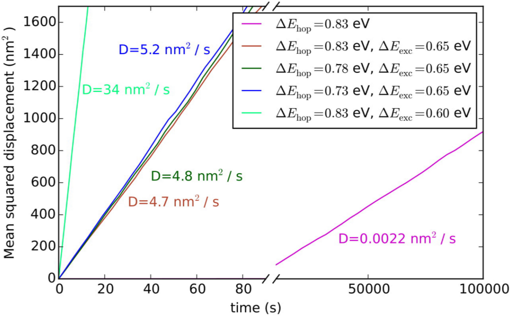
>
> 图7：Au(100) 上吸附原子的均方位移和扩散系数，以及用于跳跃和交换扩散过程的势垒。

上述示例强调了 kMC 模拟的结果在多大程度上取决于对模型中所有相关过程的了解和考虑。这是一个严肃的限制，在建立 kMC 模型时需要极其谨慎和小心。忽视交换扩散等非直觉过程的可能性怎么强调都不为过，因此 GIGO 原则非常适用。第一性原理 kMC 的另一个缺点是，计算速率常数的 DFT 能量可能会有相当大的误差。在涉及扩展表面的化学过程中，低阶半局域 DFT（low-rung semi-local DFT）方法（可能还会加上一些 $+U$ 修正）通常仍然是最先进的方法。这意味着势垒上的 DFT 误差可能很容易达到 $0.1\sim0.2\ \mathrm{eV}$ 的数量级。考虑到这些势垒以指数方式进入速率常数（见式11），相关的速率常数可能会出现数量级的误差。然而，一般来说，进入 kMC 模型的各种速率常数相关的误差并不都对模拟的输出有类似的影响。为了说明这一点，我们在图7中绘制了包括跳跃和交换扩散的扩散模型的输出，当跳跃扩散的势垒降低 $0.05\ \mathrm{eV}$（深绿线）和 $0.1\ \mathrm{eV}$（蓝线）时。可以看出，只有当跳跃扩散的势垒在交换扩散势垒的几十毫 eV 以内时，结果才开始发生显著变化。相比之下，将主要交换扩散过程的速率常数降低仅 $0.05\ \mathrm{eV}$（浅绿线）会导致扩散常数提高七倍。同样，这是速率常数与势垒呈指数关系的结果。换句话说，跳跃扩散上 $0.1\ \mathrm{eV}$ 的 DFT 误差并不会显著改变模拟的输出，而交换扩散上相同的 DFT 误差会导致输出的巨大变化。

即使在这个简单的双参数模型中，这种行为已经很难猜测，特别是在有很多反应步骤和竞争途径的催化模拟中，情况可能会更加复杂。于是，更系统地识别那些对模拟结果最重要的过程及其输入速率常数引起了研究者的兴趣。在多尺度建模的更一般背景下，将第一性原理 kMC 模拟视为一种将电子结构与介观统计技术相结合的分层多尺度建模中，这种研究被称为灵敏度分析（sensitivity analysis）。希望从这个简单的吸附原子扩散模型读者可以明晰：对于硬性 kMC 设置来说，这种分析对于评估所获得结果的意义至关重要。此外，此类分析还为了解哪些过程是控制动力学的过程提供了重要的见解，因为这些过程的速率常数对模拟结果起着决定性作用。这种深入的机理洞察能力是进行 kMC 模拟的另一个重要原因。在催化中，这些控制过程被称为决速步，在催化循环中识别而不是假设它们是进行综合 kMC 模拟的重要优点之一。在下一节讨论了这种更复杂的催化 kMC 模型的例子后，我们将在第7节回到这个话题。

## 6. 表面催化的稳态和瞬态模拟

对于催化应用，人们通常对系统达到稳态（见式13）后的行为感兴趣。由于系统是开放的（反应物的恒定流入，产物的恒定流出），即使感兴趣的量本身通常与时间无关，这仍然需要动力学模拟。主要关注的是表面组成（例如不同吸附质/反应中间体的平均覆盖率）、反应机理和各物种的产率。反应速率通常表示为 TOF，即每个表面位点（或表面积）每秒产生某种分子的平均速率。或者，对于程序升温反应`（Jansen，1995；Rieger等人，2008）`、循环伏安法`（Rai等人，2006）`或滴定法`（Piccinin和Stamatakis，2014）`等分析方法，人们可能对在给定初始状态下的系统的瞬态行为感兴趣。在下一节中，我们将介绍 $\mathrm{RuO}_2(110)$ 面上 CO 氧化的催化 kMC 模型，并说明各种初始状态的制备以及弛豫到稳态解的可能陷阱。

### 6.1. $\mathrm{RuO}_2(110)$ 面上的 CO 氧化

CO 氧化模型来自`（Reuter等人，2004）`，我们参考了这篇文献以了解其细节。在该模型中，$\mathrm{RuO}_2(110)$ 表面被认为包含两种类型的活性位点，br（桥）和 cus（配位不饱和）位点，如图8所示排列成交替的矩形晶格。每个位点可以是空的，也可以被 O 或 CO 占据。该系统中共有26个过程，包括非解离性 CO 吸附/脱附、解离性 $\mathrm{O}_2$ 吸附/脱附、O 和 CO 的扩散以及 $\mathrm{CO}_2$ 的形成，其中每种反应类型都考虑了位点类型的所有组合。由于其与表面的弱结合，形成的 $\mathrm{CO}_2$ 被认为会瞬间不可逆地解吸。

> 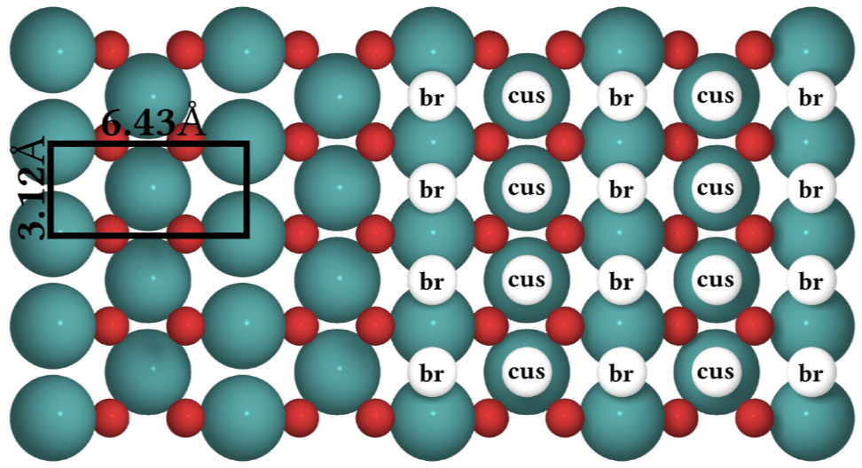
>
> 图8：$\mathrm{RuO}_2(110)$ 表面结构的俯视图。在左侧，黑色矩形框指示了一个表面晶胞。大的绿色球体代表 Ru 原子，小的红色球体代表 O 原子。在右侧绘制了粗粒度的晶格结构，它由 cus（配位不饱和）和 br（桥）位置交替组成。

在图9A中，我们显示了系统的时间演变，从空的 $(20\times 20)$ 晶格的初始状态开始，在 1 bar 的 $\mathrm{O}_2$ 和 CO 压力以及 450 K 的温度下进行模拟。在此高压下，很明显在最终的稳态将是大部分表面将被 O 或 CO 覆盖。事实上，在最初的 kMC 步骤中（即在纳秒时间尺度），这种覆盖范围会迅速扩大。O 覆盖率的增加速度大约是 CO 覆盖率的两倍，因为每次 $\mathrm{O}_2$ 吸附事件都会导致表面出现两个 O 原子，而 CO 吸附事件中只有一个 CO。在大约 $20\sim30\ \mathrm{ns}$ 之后，人们可能会误以为系统已经达到稳态解，因为 TOF 和表面覆盖率都变得稳定。这些覆盖范围大致反映了粒子撞击表面的情况，约 2/3 的 cus 和 br 位点被 O 覆盖，约 1/3 的 cus 和 br 位点被 CO 覆盖。然而，这不是真正的稳态！在延长时间的 kMC 模拟过程中（在几秒钟的时间尺度），覆盖率再次发生巨大变化，直到所有 br 位点中只有约 1/3 被 O 覆盖（其余被 CO 覆盖），基本上所有 cus 位点都被 CO 覆盖。在这些长时间变化的过程中，TOF 与之前的表观稳态相比下降了三个数量级以上。这种双时间尺度行为的原因是，O 原子对初始空晶格的双重撞击使许多 br 位点充满了氧。这些 $\mathrm{O^{br}}$ 原子结合非常牢固，非常不活跃。它们肯定不会轻易解吸，一旦形成这些 $\mathrm{O^{br}}$ 原子，就需要具有相对较高势垒（小速率常数）的 CO 氧化反应来去除它们。因此，后一种过程比初始填充需要更长的时间，而且由于在这种长期转化中，CO 也几乎取代了所有高反应性的 $\mathrm{O^{cus}}$ 物种，TOF 也会降低。

> 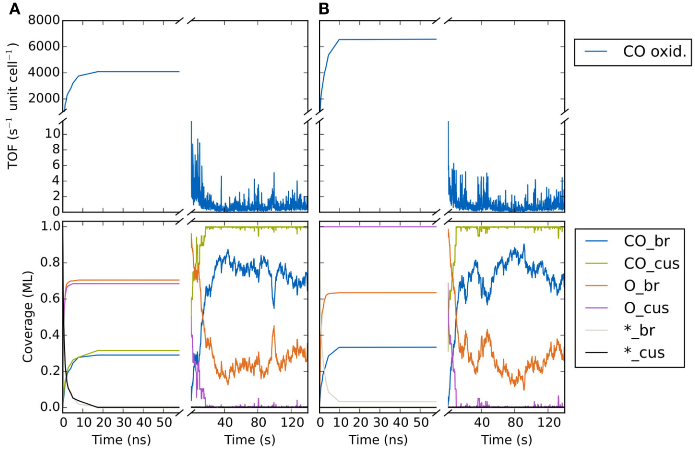
>
> 图9：（上）CO 氧化 TOF 的时间演变。
> 
> （下）$\mathrm{RuO}_2(110)$ 晶格 cus 和 br 位点上 CO、O 和空位的表面覆盖。系统的初始状态为：（A）空晶格；（B）1 ML 氧覆盖的 cus 位点和空 br 位点。温度为 450 K，气相 CO 和 $\mathrm{O}_2$ 压力均为 1 bar。

正如这个例子深刻地证明，在 kMC 模拟中确定什么是真正的稳态可能是一个重大挑战。事实上，更确切地说，人们真正想要的是某种形式的自动化算法，一旦模拟达到稳定状态，它就会发出信号。在实际应用中，需要进行数十甚至数百次不同的 kMC 模拟，例如评估不同的气相条件或确定催化剂表面成分变化（掺杂某些金属原子等）的影响。在正在进行的 kMC 模拟中，必须监测感兴趣的量，然后手动判断是否达到稳态，这变得越来越不切实际和繁琐。不幸的是，这种全自动防呆的稳态检测（steady-state detection, SSD）尚未开始用于 kMC 模拟。相比之下，在信号处理和过程控制领域有相当多可用的知识`（Cao和Rhinehart，1995；Kelly和Hedengren，2013）`。直到最近，这些算法才进入 kMC 社区`（Núñez等人，2017；Nellis等人，2018）`。通常，它们被应用于几个感兴趣的性质（反应速率、覆盖率、总晶格能等），以避免对稳态的假阳性检测。即便如此，可能还需要进一步的测试和方法开发来确定它们是否总是可以万无一失地应用。

在没有这种复杂的 SSD 算法的情况下，一种实用的方法通常是对所研究的系统有深入和全面的了解，并且非常谨慎地进行建模（当然这不是一个万无一失、优雅的解决方案）。另一种方法是从精心选择的不同初始条件开始模拟，然后监测是否达到相同的稳态，这意味着该系统不会表现出多重稳态。这种行为在微分方程的解中是众所周知的，例如在 MFA 微动力学模型的背景下`（Ramachandran等人，1981）`。对于表面催化背景下的 kMC 模拟，还没有报道过不是因为认为假设模拟结果收敛的多重稳态，也可能涉及区分这两种情况。在任何情况下，从不同的初始条件开始运行多个 kMC 模拟，然后监测它们收敛到哪里，都不会有什么坏处。显然，初始条件选择得越接近最终稳态，模拟可能会收敛得越快。

尽管如此，例如在使用先前（类似的）模拟中确定的稳态配置初始化时，人们也可能被困在先入为主的配置中。对于 CO 氧化模型，我们在图9B中说明，从一个完全不同的初始状态开始，实际上是如何导致相同的稳态的。在这里，初始状态对应于 cus 位点上 1 ML 氧覆盖和空的 br 位点的。对于纳秒时间尺度，我们再次看到（不同的）准稳态解的出现，其中 cus 位点仍被 O 占据，而 br 位点被约 0.35 ML CO 和约 0.65 ML O覆盖。然而，与其他初始化类似，在秒的时间尺度上，系统再次转换，我们得到了与之前相同的稳态解。在了解了这种双时间尺度行为的原因后，最合适的初始化方法是用 CO 覆盖所有 br 位点，以防止 $\mathrm{O^{br}}$ 的初始大规模积聚。在这种情况下，实际上非常快地达到了真正的稳态（未显示在图中）。然而，很少有人从一开始就对系统的性质有如此详细的了解，从若干个差异很大的初始状态开始的方法通常是我们最好的、希望可靠的方法。

一旦达到稳态解，就可以利用 kMC 模拟的遍历性来计算所需的量（表面组成、各种基本步骤的发生率、TOF 等），可以使用时间平均值，而不是系综（轨迹）平均值。例如，生成给定分子 $\beta$ 的平均反应速率 $\langle r^{\beta} \rangle$ 可以计算为：

$$ \langle r^{\beta}\rangle=\frac{1}{t_{{\mathrm{kMC}}}}\sum_{n=1}^{{N_{{\mathrm{kMC}}}}}\sum_{j}k_{ij}^{\beta}\Delta t_{{\mathrm{escape},n}} \tag{20}$$

其中 $t_{\mathrm{kMC}}$ 是总 kMC 模拟时间，第一个求和作用在所有 kMC 步骤 $n$ 上（最多到 $N_{\mathrm{kMC}}$），第二个求和作用在从当前状态 $i$ 可访问的所有状态 $j$ 上，$k_{ij}^{\beta}$ 是涉及分子 $\beta$ 生成过程的速率常数，$\Delta t_{{\mathrm{escape},n}}$ 是 kMC 步骤 $n$ 的逃逸时间。应选择足够长的总模拟时间，以将采样量的统计误差减小到所需值。在连续轨迹片段的统计误差计算中，必须选择足够长的轨迹片段模拟时间，使得每个轨迹片段在统计上与其他片段相互独立。所需时间称为去相关时间，它描述了当前系统配置与轨迹片段中的初始系统配置达到不相关所需的时间。如果感兴趣的量是在给定初始状态下系统的瞬态行为（例如程序升温反应`（Jansen，1995；Rieger等人，2008）`，循环伏安法`（Rai等人，2006）`，或滴定实验`（Piccinin和Stamatakis，2014）`），必须计算并平均几个统计上独立的轨迹。例如，可以通过使用不同的随机数种子来实现统计独立性，正如本文第5.1节中对吸附原子扩散模型所做的那样。

## 7. 灵敏度分析和不确定性量化

如第5.1节所述，了解模型中各种过程的速率常数对模型预测的影响程度，从而量化这些预测的不确定性，可能是很感兴趣的研究。这通常被称为灵敏度分析和不确定性量化（uncertainty quantification, UQ）。这些方法试图回答的主要问题是：（i）误差传播：在用于计算速率常数的理论层面引入的误差是如何传播到模型预测的？哪些速率常数对于高精度计算最重要（一旦知道临界速率常数，也许可以递归地改进这些计算）？尽管存在误差，但依然可以可靠地得出哪些结论？（ii）设计和优化：实现给定催化剂或电池材料的最佳性能的局限性是什么？应如何改变速率常数（例如，通过改变材料）以实现这种最佳性能？

专门为催化引入的一种灵敏度测量方法是反应步骤 $I$ 的速率控制度（degree of rate control, DRC）$X_{\text{RC},I}$：`（Campbell，1994）`

$$ X_{\text{RC},I}=\frac{k_I}{\langle r^\beta\rangle}\biggl(\frac{\partial\langle r^\beta\rangle}{\partial k_I}\biggr)_{k_{J\neq I},K_I} \tag{21}$$

其中，应计算目标产物 $\beta$ 的平均反应速率 $\langle r^\beta\rangle$，并在保持所有其他反应步骤 $J$ 的速率常数 $k_J$ 和步骤 $I$ 的平衡常数 $K_I$ 不变的情况下评估导数。DRC 的正（负）值表示当增加 $k_I$ 时反应速率会增加（减少），而零值表示反应速率对 $k_I$ 的变化不敏感。DRC 遵循求和规则，即所有 DRC 的总和等于1`（Meskine等人，2009；Hoffmann等人，2017）`。等于1的单个非零 DRC 表示反应机制中的单个决速步，而一般来说，几个步骤可以同时限速。步骤 $I$ 的平衡常数保持恒定的事实意味着步骤 $I$ 的正向和反向速率常数同时变化，这也可以被视为步骤 $I$ 的 TS 能量的变化（对于活化过程）。后来，DRC 概念被扩展到热力学版本，其中反应中间产物的能量是变化的`（Stegelmann等人，2009）`。显然，这些敏感性指标可以很容易地扩展到反应速率以外的其他感兴趣的量。从实用的角度来看，评估 DRC 表达式的导数的主要挑战是，我们没有 kMC 中反应速率的分析表达式。依靠有限差分采样，通常需要很长的模拟时间来充分减少统计误差`（Meskine等人，2009）`。最近提出了一种更有效的三阶段方法`（Hoffmann等人，2017）`，该方法允许从单个 kMC 轨迹直接采样灵敏度测量值。

DRC 灵敏度度量被表述为线性响应理论，这意味着结果仅在输入参数空间中局部有效。然而，动力学模型通常是高度非线性的，DRC 可以在对应于 DFT 误差的速率常数变化上发生实质性变化，例如反应势垒上的 $\plusmn0.2\ \mathrm{eV}$。因此，最近开发了许多用于全局敏感性分析和 UQ 的方法，即评估尽管输入参数存在不确定性，但依然可以可靠地得出关于模型的哪些结论`（Sutton等人，2016；Döpking和Matera，2017）`。`（Sutton等人，2016）`进一步指出，kMC 模型的输入参数误差通常高度相关。这种相关性可能会出现，因为使用的 DFT 泛函通常会高估或低估某些动力学参数。已利用相应的 DFT 函数相关性来评估氨合成 MFA 微动力学模型中反应速率的不确定性`（Medford等人，2014）`，该模型使用贝叶斯误差估计函数和 van der Waals 相关性（BEEF vdW）`（Wellendorff等人，2012）`进行。后一个函数不仅为给定的动力学参数提供了单个值，而且提供了通过对交换相关性模型参数中的已知不确定性进行采样而生成的一组值。动力学参数相关性的另一个来源是化学相关中间产物和 TS 的吸附能存在相关性，通常称为标度关系`（Nørskov等人，2002；Michaelides等人，2003；Abild Pedersen等人，2007）`（见第4.2.3节）。`（Sutton等人，2016）`进行的敏感性分析和 UQ 中考虑了这两种相关性来源，并将其应用于乙醇蒸气重整的动力学模型。该方法允许评估所提出的反应机制是否可以在已知的 DFT 误差范围内与实验数据一致，并可以揭示局限性，例如在多相催化模型中可能没有考虑载体效应。

说实话，大多数从业者的日程上还没有这样复杂的敏感性分析。在本表面 kMC 模拟实用指南的背景下，作为一个非常粗略和简单的建议，我们建议始终至少手动改变 kMC 模型中的一些关键速率常数，看看这会如何改变模拟结果。这很容易做到，它提供了一个粗略的（可能不完整，但总比没有好）见解，说明什么可能是关键输入，以及所研究的反应网络中的依赖关系是什么。如果这标志着关键敏感性，人们可以而且应该就此深入研究。老实说，如果从 kMC 模拟中提取的要点严重依赖于一个或几个速率常数的高度特定的数值，并且人们知道这些值存在很大的不确定性，那么谁愿意冒这个险呢？

## 8. 时间尺度不一致的问题

kMC通过避免显式处理系统的振动自由度，而只考虑吸附/解吸、扩散或反应步骤等罕见事件，实现了比 MD 模拟更快的速度（见第2.1节）。然而，在 kMC 模拟中处理的那些罕见事件也可能在很大程度上不同的时间尺度上发生。在这种情况下，几乎所有的 CPU 时间都花在模拟快速过程上，而由慢速过程引起的（可能真正重要的）动态采样不足或根本没有采样。对于金属表面反应的 kMC 模型来说，这尤其成问题，因为反应网络中通常同时发生非常快的表面扩散过程和缓慢的表面反应。

已经开发了各种方法来处理这种时间尺度差异问题。$\tau\text{-}leap$ 方法是一种近似方法，通过同时启动多个过程来加速 kMC 模拟`（Gillespie，2001）`。然而，该方法的基本假设（跳跃条件）仅在粗略时间增量 $\tau$ 期间表面物种近似恒定时才成立。因此，该方法不适用于微观晶格上的表面反应，在微观晶格上，从一个 kMC 步骤到下一个步骤，位点物种可能会发生巨大变化（例如，从零物种到一个物种）。在实践中，该方法仅适用于粗粒度晶格，其中一个较大粗粒度单元内的物种浓度在时间上近似恒定。其他方法依赖于将过程分为“慢”和“快”过程。他们仅在 kMC 水平上随机处理缓慢过程动力学，而快速过程动力学则采用确定性或朗之万方程进行处理`（Haseltine和Rawlings，2002；Salis和Kaznessis，2005）`。这类方法的一个主要缺点是，过程时间尺度分离必须由用户提前指定，并在整个模拟过程中保持不变。

因此，在实践中，最近的 kMC 工作通常依赖于简单的加速方案，该方案通过降低系统中最快过程的速率常数来发挥作用，以使时间跨度易于处理（见图10）。对于简单的反应网络，可以手动进行速率常数缩放，并验证模型输出不受缩放的影响`（Rogal等人，2008；Piccinin和Stamatakis，2014；Lorenzi等人，2016；Jørgensen和Grönbeck，2017）`。最近，也出现了自动缩放快速过程的算法，而无需用户提前指定这些过程`（Chatterjee和Voter，2010；Dybeck等人，2017）`。这些方法的一个主要假设是，快速过程在有限次数的执行后达到准平衡，即假设不需要继续模拟这些过程来正确描述系统动力学。`（Chatterjee和Voter，2010）`的 accelerated superbasin KMC（AS-KMC）方法将超盆地定义为一组晶格配置，系统可以通过执行准平衡过程在这些配置之间跳跃（见图10）。然后，非平衡过程的执行定义了新的超盆地的进入。因此，加速算法的目标是通过快速、准平衡过程的缩放，鼓励系统更早地离开当前的超盆地。对于复杂系统，这种方法的一个缺点是系统配置的总数可能非常大，这可能会导致算法效率低下，因为即使是单个超盆地的完全采样也会变得非常慢。

> 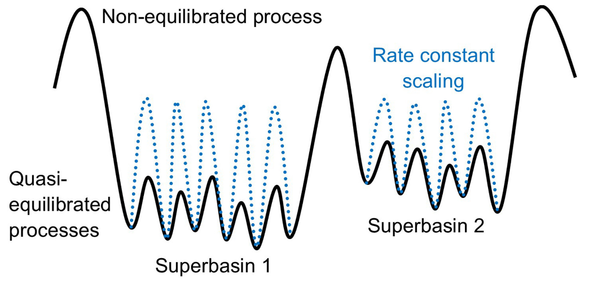
>
> 图10：由于势垒的巨大差异而在不同时间尺度上发生过程的系统的势能面（PES）。由快速（低势垒）、准平衡过程连接的一组状态构成了一个超盆地。该系统可以通过执行缓慢（高势垒）、非平衡的过程从一个超盆地逃逸到另一个超盆地。通过缩放快速、准平衡过程的速率常数（增加势垒）来加速 kMC 模拟。这减少了系统离开当前超盆地所需的时间，从而增强了 PES（其他超盆地）邻近区域的采样。

`（Dybeck等人，2017）`提出的方法解决了这个问题，该方法不跟踪系统配置（超盆地状态）和过程，而是只跟踪一些用户定义的反应途径的执行。例如，反应途径可以是某些物种在给定位点类型的吸附/解吸，与该反应在晶格上发生的位置无关，然后将速率常数的缩放应用于整个反应途径。缩放仍然只适用于在当前超盆地内执行了最少次数的过程，并且正向执行次数大致等于反向执行次数，使其在一定容差范围内。一旦执行了非平衡过程，速率常数再次取消缩放，以便对新的超盆地进行充分采样，然后重新开始该过程。该算法被证明在钌纳米颗粒上的 Fischer-Tropsch 合成反应模型中效果良好`（Dybeck等人，2017）`。`（Núñez等人，2017）`和`（Hoffmann和Bligaard，2018）`采用了与 kMC 加速非常相似的方法，但不包括取消缩放步骤。在`（Núñez等人，2017年）`的研究中，加速方案与有限差分之外的有效灵敏度分析（类似于前一节讨论的`（Hoffmann等人，2017）`的方法）一起使用，改进了时间尺度差异较大的 kMC 模型中的灵敏度测量采样。

`（Andersen等人，2017)`在kmos代码中实现了`（Dybeck等人，2017年）`的算法，并使用基于比例关系的速率常数表达式应用于过渡金属系列阶梯表面上 CO 甲烷化的趋势研究。此外，对于这种更复杂的反应机理和许多不同催化剂表面，加速算法通常表现良好。然而，也发现了一些导致算法崩溃的具有挑战性的案例。该算法的一个特别有问题的情况是两种低覆盖率物种之间发生反应，这两种物种都是在独立的、准平衡的反应步骤中产生的。在这种情况下，算法可能会过于激进地缩放准平衡步骤的速率常数，导致在需要这两个低覆盖率物种在邻近晶格位点上发生反应的晶格构型中，采样不足或根本没有采样。这个问题可能与`（Dybeck等人，2017）`的算法不跟踪系统配置有关，因此无法验证超盆地内的所有配置是否都已充分采样。`（Andersen等人，2017）`提出了一种简单的校正方案，该方案在反应路径的定义中考虑了最近邻位点的晶格结构。这被证明对直接在相邻位点形成的两种低覆盖率物种之间的反应的简单情况很有效。然而，如果低覆盖率物种是在较远的晶格位点产生的，并且依赖于反应步骤之前的扩散步骤，则不适用。

从某种意义上说，具有讽刺意味的是，kMC 受到快速扩散步骤的挑战，而其有效竞争对手 MFA 微动力学模型受到缓慢扩散步骤的挑战。即使在没有横向相互作用的情况下（通常用于支持 MFA 的有效性），这种缓慢的扩散过程也会阻止系统达到 MFA 中假设的充分混合状态。在金属中，这被证明发生在强结合台阶位点`（Andersen等人，2017）`，而在氧化物中，这可能仅仅是由于这些化合物材料具有更高的扩散势垒。对于第6.1节中讨论的 $\mathrm{RuO}_2(110)$ 面上 CO 氧化的 kMC 模型，相应的 MFA 失效可以归咎到 $\sim 1.6\ \mathrm{eV}$ 的相对较高的 O 扩散势垒`（Temel等人，2007；Matera等人，2011；Exner等人，2015）`。在这方面，基本上没有表面催化系统可以普遍期望 MFA 给出正确答案：在金属上，MFA 通常由于附近位点上的强横向相互作用而失效（见下一节）；在氧化物等化合物中，高扩散势垒阻止了吸附层的快速充分混合。问题在于，尽管像第3节讨论的现代 kMC 实现已变得更高效，但它们通常仍然比平均场模型要求更高的算力。时间尺度差异问题显著放大了这一点，尽管最近的加速算法已经变得更好，但这个问题还没有完全解决。这仍然让许多用户不得不采用 MFA 微动力学建模，尽管它可能不准确。或者，在准确性和计算成本方面介于 MFA 和 kMC 之间的算法，如准化学近似（quasichemical approximation），也已经应用于催化反应`（Hellman和Honkala，2007年）`，并且在某些情况下已被证明可以在显著降低成本的情况下复现 kMC 模拟。

## 9. 横向相互作用

横向相互作用是指吸附到晶格上的物种之间的相互作用。作用可以是吸引或排斥，取决于所涉及物种的化学性质以及定义 kMC 晶格的表面或块状材料。最近的几项研究发现，横向相互作用对于正确描述系统动力学至关重要`（Stamatakis和Piccinin，2016；Jørgensen和Grönbeck，2017；Piccinin和Stamatakis，2017；Vignola等人，2017；Hus和Hellman，2019）`。如第2.2节所述，通过为每个相邻配置分配一个单独的跳跃频率常数，在 kMC 的晶格近似中考虑横向相互作用（见图3）。在排斥相互作用的情况下，与空的相邻位点相比，粒子更有可能从具有被占据的相邻位点的初始配置中跳出。这将导致粒子在晶格上扩散，以最大化粒子间的距离。对于有吸引力的相互作用，情况正好相反，粒子将显示出形成团聚的趋势。这两种情况都会导致晶格上有序结构的形成。因此，它们可能会导致平均场处理的不准确，因为 MFA 假设粒子随机分布，且位点之间没有任何相关性（`Liu等人，2016；Stamatakis和Piccinin，2016；Pineda和Stamatakis，2017）`。

在实践中，横向相互作用可以通过一般的簇扩展方法在晶格 kMC 模型中得到解释`（Sanchez等人，1984；Stampfl等人，1999；Müller，2003）`。在这种方法中，晶格能通过晶格气哈密顿量扩展为离散相互作用（簇）的总和，如成对相互作用、三体相互作用等。因此，对于晶格上的某个吸附粒子，将评估哪种类型的邻居有多少位于哪种距离（最近邻、下一近邻等）。对于每个这样的邻居，孤立粒子在该位点类型的晶格上的吸附能（或更一般的速率常数）将根据晶格气哈密顿量规定的一定量进行校正。总和所有这些贡献定义了成对交互作用。然后，查找两个同时存在的相邻物种的所有可能的排列，对于这些排列，再次进行能量（速率常数）校正。这定义了成对相互作用的三体校正，以此类推，这适用于越来越高的多体相互作用。虽然考虑到多达三体和四体项的簇扩展已经用 DFT 对简单系统进行了参数化`（Jansen和Offermans，2005；Zhang等人，2007；Schmidt等人，2012；Wu等人，2012，Piccinin和Stamatakis，2014）`，但目前在具有许多物种和位点类型的更复杂系统中，簇扩展通常在第一近邻成对相互作用项之后就被截断，以保持计算成本的可控性`（Stamatakis和Vlachos，2011；Yang等人，2013）`。一种特别粗糙的形式是所谓的位点阻断规则（site-blocking rules）`（Hoffmann和Reuter，2014；Liu等人，2016；Lorenzi等人，2016）`，即强排斥的第一近邻相互作用是通过抑制任何会立即生成这种紧邻物种的 kMC 过程来简单地模拟的。此外，簇扩展通常仅用于稳定和亚稳定吸附位点的吸附物，因为同时考虑过渡态，即横向相互作用引起的势垒高度变化，可能会使 DFT 参数化变得棘手。在 ZACROS 中，吸附质内置了 kMC 码簇扩展，并通过近似的 Brønsted-Evans-Polanyi 关系考虑了横向相互作用对过渡态的影响`（Nielsen等人，2013）`。簇扩展方法的一个主要缺点是，对于复杂系统，DFT参数化和 kMC 模拟的计算成本很快就会变得难以处理。`（Wu等人，2012）`对簇扩展参数化的基准测试（benchmark）表明，当考虑的簇数量从3个增加到12个时，kMC 模拟的计算成本增加了约5个数量级。当然，这取决于实际的 kMC 实现和使用的算法，特别是像 ZACROS 这样的代码是为了在考虑横向交互时降低额外成本而编写的。

尽管成本增加，但我们再次强调，横向相互作用不仅对表面扩散，而且对晶体生长和多相催化都起着重要作用。因此，在下文中，我们将为考虑横向相互作用的晶体生长和多相催化应用领域提供两个示例的 kmcos 模型 [译者注：原文为 kmos]。对于更贴近现实的增长和横向相互作用模型，我们参考了`（Fichthorn等人，2002；Ruan和Schuh，2010；Shirazi和Elliott，2014）`的工作。

### 9.1. 具有横向相互作用的 kmcos 模型

我们将在本节简要介绍两个可用的 kmcos 后端以及它们各自处理横向交互的方式。`local_smart` 后端是原始后端，已被用作其他后端的基础和灵感。它的构建隐含着以牺牲内存为代价提供最佳运行速度的目标。因此，此后端中的一个关键元素是预先计算的速率常数列表，即速率目录。再加上在每个 kMC 步骤后对可用过程的有效本地更新，这使得它在不同速率常数的数量较少时成为最有效的后端。`local_smart` 后端实现了对横向交互的最简单处理，其中任何新的邻居配置都定义了一个新的 kMC 过程，其速率常数与此特定配置相关联。对于具有横向交互的模型，由于其具有指数级增长的过程数量和相互作用数量，这种方法有几个缺点：（i）几个与过程总数相关的进程的执行时间可能会变得很长；（ii）目录数据结构的大小随着过程总数的变化而变化，可能会变得太大而无可用内存；（iii）源代码的大小可能会变得非常大，由于内存要求，编译非常慢甚至不可能。

`on_the_fly(otf)` 后端是为了缓解 `local_smart` 后端遇到的问题，并实现复杂横向相互作用模型的 kMC 模拟后端。顾名思义，它实时计算速率常数，而不是使用预先计算的速率目录。在 `on_the_fly(otf)` 后端，每个过程的本地环境是通过 `bystander` 列表来考虑的。这里的 `bystander` 是一个邻近的位点，根据实时计算的速率常数，其占据与否会影响过程的速率常数。这种方法的好处是，模型中的过程总数相对于考虑的交互数量是恒定的。另一方面，其缺点是由于需要扫描晶格并明确地求和所有速率常数，以计算总逃逸速率常数 $k_{\mathrm{tot}}$（式9），现在每个 kMC 步骤的计算时间都与系统大小呈线性关系。

现在转到示例，我们将首先介绍一个具有横向相互作用的晶体生长 kmcos 模型，该模型足够简单，可以在 `local_smart` 后端高效处理。对于这个模型，我们考虑了一个三维二次晶格和沉积在固体基质上的单一物种，其吸附速率常数为 $k_{\mathrm{ads}}=3\times 10^{−3}\ s^{−1}$。低覆盖率解吸势垒 $\Delta E_0$ 设置为 1 eV。此外，我们考虑了与最近邻物种的吸引成对横向相互作用 $\epsilon_{\mathrm{int}}=0.5\ \mathrm{eV}$。因此，解吸过程的速率常数 $k_{\mathrm{des}}$ 为：

$$ k_{{\mathrm{des}}}=\frac{k_{\mathrm{B}}T}{h}\exp\left(-\frac{\Delta E_{0}+n_{\mathrm{NN}}\cdot\epsilon_{\mathrm{int}}}{k_{\mathrm{B}}T}\right) \tag{22}$$

其中 $n_{\mathrm{NN}}$ 是晶格配置中最近邻物种的数量。为了使解吸过程成为可能，物种必须位于表层，即其正下方的位点必须被占用，其正上方的位点必须是空的。然后考虑相同高度的四个相邻位点的横向相互作用（见图11A）。由于每个相邻位点只有两种可能的配置（空的或被占用），这导致只有16种不等价的解吸过程类型，因此可以在 `local_smart` 后端中有效地处理该模型。

在图11B中，我们显示了 350 K 和 450 K 温度下生长的晶体结构的快照。在这两种模拟中，系统都是在对应于一层可以发生吸附的固定基底物种（蓝色原子）的初始状态下制备的。正如预期的那样，生长的结构在更高的温度下变得更凭证，沉积在不利吸附位点上的原子与邻近物种没有吸引力的相互作用，更有可能解吸。通过将扩散过程也包括在内，并考虑更详细的横向相互作用簇扩展模型，该模型可以变得更加符合真实情况。

> 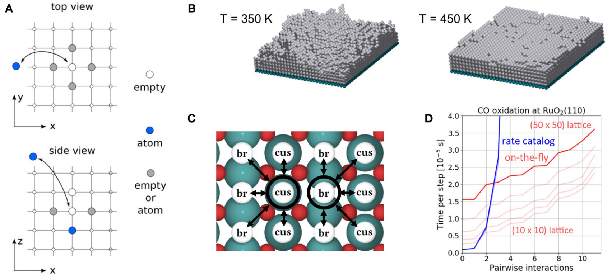
>
> 图11：（A）晶体生长模型解吸过程的横向相互作用模型。解吸物种正下方的位置始终被占据，因此其相互作用能被包含在低覆盖率解吸势垒中。位于相同高度的四个相邻位点可以是空的或被占用的，并相应地修改解吸速率常数。
> 
> （B）在两个不同温度下生长的晶体结构的快照。
> 
> （C）$\mathrm{RuO}_2(110)$ 面上 CO 氧化模型中成对相互作用的图示。
> 
> （D）CO 氧化模型的 kmcos 性能是两个不同后端（rate catalog 和 on_the_fly）考虑的成对相互作用数量的函数。使用rate catalog，性能与晶格大小无关。而在 on_the_fly 中，成本随着晶格尺寸呈线性增长（与（N×N）模拟单元的长度 N 呈二次增长），如 N 等于10、20、30、40、50（不同的红线）所示。

作为下一个例子，我们回到第6.1节中已经讨论过的 $\mathrm{RuO}_2(110)$ 面上 CO 氧化模型。为了探索 `local_smart` 和 `on_the_fly` 后端的 kmcos 性能如何受到逐渐复杂的横向交互模型的影响，我们逐步将成对交互添加到模型中的每个过程中。图11C中的黑色箭头显示了涉及两个相邻位点（用黑色圆圈标记）的二阶过程（例如 $\mathrm{O}_2$ 解吸）的可能成对相互作用。每个后端的性能与所包含的交互数量的关系如图11D所示。对于 `local_smart` 后端（rate catalog），成本随着交互数量的增加呈指数级增长，我们实际上仅限于最多四对交互的简单交互模型。这是因为 rate catalog 中的过程数量随着相互作用的数量呈指数级增长，即以每个相邻位点的3种可能状态（O、CO 或空）为底数，所考虑的相邻位点（相互作用）数量为指数的增长。在 `on_the_fly` 后端中，成本仅随交互数量呈线性增长，并且在所有考虑的系统大小下都是可处理的，尽管成本与所使用的（N×N）模拟单元的长度 N 呈二次关系（与系统大小呈线性关系）。值得注意的是，这里专门为 kmcos 提出的 `on_the_fly` 算法并不新鲜。例如，ZACROS代码`（Nielsen等人，2013）`也实时计算速率常数。

从上述例子中可以明显看出，横向相互作用对 kMC 模型来说是一把双刃剑。一方面，通过簇扩展系统地考虑局域环境影响的能力使模型具有潜在的极高精度，并构成了优于 MFA 模型的巨大优势。另一方面，横向相互作用的加入抵消了利用晶格近似（见第2.2节）获得的所需第一性原理速率常数数量的减少，并为 kMC 模拟带来了额外的复杂性和成本。因此，在实践中，横向相互作用模型的选择往往（不幸地）由计算可行性决定，即使众所周知适当的相互作用模型对动力学模型的有效性至关重要。

## 10. 总结与展望

过去十年见证了令人印象深刻的增长，不仅在采用预测性第一性原理 kMC 建模的研究数量上，而且在可用的新代码数量上。特别是对于多相催化应用，所采用的模型越来越能够处理所采用的反应机理和所建模的催化材料结构的复杂性。这些进步得益于用于确定输入过程和速率常数的算法发展，以及用于执行 kMC 模拟的实际算法的发展。

随着许多新的 kMC 研究者进入这个令人兴奋的领域，本教程回顾的目的是为构建和评估 kMC 模型提供必要的实用指南和示例，并强调在此过程中遇到的陷阱以及当前的挑战和前景。我们详细讨论了如何利用晶格近似来利用表面晶格的晶体对称性，从而减少所需的第一性原理速率常数的数量。这也涉及陷阱和挑战，特别是当表面发生动态重组时，或表面物种的明确吸附位点不存在时。我们简要讨论了非晶格（自适应）kMC 如何通过自动识别可能的状态和过程来克服这些局限性，以及与预定义的（可能不完整的）可能过程列表相关的局限性。然而，尽管有这种令人兴奋的前景，但这些方法在实践中仍然受到高昂成本的阻碍。

即使对于晶格 kMC 模型，所需的第一性原理速率常数的数量也可能令人望而生畏。普遍的 TST 方法需要 TS 的位置，通常还需要确定前置因子和零点振动能，至少要确定系统的谐波频率。虽然希望通过 DFT 或其他电子结构方法进行这些计算以实现预测质量模型，但开发更便宜的方法可能会大大增加解决的复杂问题的可能性。为此，我们讨论了 BEP 和标度关系，作为目前的一个流行的例子。对于未来，开发越来越精确的半经验方法，如密度泛函紧束缚方法（DFTB）、反应力场或基于机器学习的力场，是一个有趣的视角，我们认为它具有很高的潜力。TS 的实际确定通常是计算瓶颈，为此，我们讨论了多种方法及其各自的优缺点。此外，我们讨论了在局部环境显著影响速率常数的情况下，如何通过簇展开方法系统地提高晶格 kMC 模型中所用速率常数的准确性。

对于使用第一性原理 DFT 速率常数构建的 kMC 模型，人们仍然必须记住，势垒的预期误差很容易达到几百毫 eV 的数量级。这可能会导致速率常数有几个数量级的误差。解决这一重大缺陷的一种实用方法是估计模型对输入速率常数的敏感性，并量化这些预测的不确定性。为此，我们讨论了各种方法，从简单的参数变化到考虑输入速率常数之间相关性的复杂模型。这里一个令人兴奋的观点是，随着关于各种输入过程的重要性的信息越来越可用，对所用速率常数的不断改进成为可能，可能还涉及所采用的横向相互作用模型。

尽管 kMC 已经取得了长足的进步，但未来仍有许多挑战需要应对。其中一个例子是不可避免的时间尺度差异问题，它继续挑战着 kMC 的实际应用。我们讨论了过去几十年出现的各种方法，特别关注最近的自动识别模拟瓶颈的加速算法，即快速、准平衡的过程。虽然这些方法在许多情况下可以很好地工作，但也有一些例子表明它们可能会崩溃。未来几年，这一领域可能会有进一步的发展改善。

## 补充材料

本文的补充材料可在 https://www.frontiersin.org/articles/10.3389/fchem.2019.00202/full#supplementary-material 查阅，包括本文所有 kmos 示例的 Python 代码。

[译者注：由译者适配后的 kmcos 代码可在 https://github.com/EightEggs/kmcos-examples 获取]

## 参考文献

Abild-Pedersen, F., Greeley, J., Studt, F., Rossmeisl, J., Munter, T. R., Moses, P. G., et al. (2007). Scaling properties of adsorption energies for hydrogen- containing molecules on transition-metal surfaces. Phys. Rev. Lett. 99:016105. doi: 10.1103/PhysRevLett.99.016105

Andersen, M., Plaisance, C. P., and Reuter, K. (2017). Assessment of mean-field microkinetic models for co methanation on stepped metal surfaces using accelerated kinetic Monte Carlo. J. Chem. Phys. 147:152705. doi: 10.1063/1.4989511

Bassett, D., and Webber, P. (1978). Diffusion of single adatoms of platinum, iridium and gold on platinum surfaces. Surf. Sci. 70, 520–531. doi: 10.1016/0039-6028(78)90429-6

Bortz, A., Kalos, M., and Lebowitz, J. (1975). A new algorithm for monte carlo simulation of ising spin systems. J. Comput. Phys. 17, 10–18. doi: 10.1016/0021-9991(75)90060-1

Campbell, C. T. (1994). Future directions and industrial perspectives micro- and macro-kinetics: Their relationship in heterogeneous catalysis. Top. Catal. 1, 353–366. doi: 10.1007/BF01492288

Cao, S., and Rhinehart, R. (1995). An efficient method for on-line identification of steady state. J. Process Contr. 5, 363–374. doi: 10.1016/0959-1524(95)00009-F

Carilli, M. F., Delaney, K. T., and Fredrickson, G. H. (2015). Truncation-based energy weighting string method for efficiently resolving small energy barriers. J. Chem. Phys. 143:054105. doi: 10.1063/1.4927580

Chatterjee, A., and Vlachos, D. G. (2007). An overview of spatial microscopic and accelerated kinetic monte carlo methods. J. Comput. Aided Mater. Des. 14, 253–308. doi: 10.1007/s10820-006-9042-9

Chatterjee, A., and Voter, A. F. (2010). Accurate acceleration of kinetic monte carlo simulations through the modification of rate constants. J. Chem. Phys. 132:194101. doi: 10.1063/1.3409606

Chill, S. T., and Henkelman, G. (2014). Molecular dynamics saddle search adaptive kinetic monte carlo. J. Chem. Phys. 140:214110. doi: 10.1063/1.4880721

Chorkendorff, I., and Niemantsverdriet, J. W. (2017). Concepts of Modern Catalysis and Kinetics, 3rd Edn. New York, NY: Wiley.

Döpking, S., and Matera, S. (2017). Error propagation in first-principles kinetic monte carlo simulation. Chem. Phys. Lett. 674, 28–32. doi: 10.1016/j.cplett.2017.02.043

Dybeck, E. C., Plaisance, C. P., and Neurock, M. (2017). Generalized temporal acceleration scheme for kinetic monte carlo simulations of surface catalytic processes by scaling the rates of fast reactions. J. Chem. Theory Comput. 13, 1525–1538. doi: 10.1021/acs.jctc.6b00859

Exner, K. S., Heß, F., Over, H., and Seitsonen, A. P. (2015). Combined experiment and theory approach in surface chemistry: stairway to heaven? Surf. Sci. 640, 165–180. doi: 10.1016/j.susc.2015.01.006

Feibelman, P. J. (1990). Diffusion path for an al adatom on al(001). Phys. Rev. Lett. 65, 729–732. doi: 10.1103/PhysRevLett.65.729

Fichthorn, K., Merrick, M., and Scheffler, M. (2002). A kinetic monte carlo investigation of island nucleation and growth in thin-film epitaxy in the presence of substrate-mediated interactions. Appl. Phys. A 75, 17–23. doi: 10.1007/s003390101051

Fichthorn, K. A., and Weinberg, W. H. (1991). Theoretical foundations of dynamical monte carlo simulations. J. Chem. Phys. 95, 1090–1096. doi: 10.1063/1.461138

Frenkel, D., and Smit, B. (2001). Understanding Molecular Simulation: From Algorithms to Applications (Computational Science Series, Vol 1). Cambridge, MA: Academic Press.

Garhammer, A. (2017). kmc-Simulation of Magnetic Resonance Spectra of Ion Dynamics in All-Solid-State li ion Batteries. Master’s thesis, Technical University of Munich, Department of Physics.

Gelten, R. J., Jansen, A. P. J., van Santen, R. A., Lukkien, J. J., Segers, J. P. L., and Hilbers, P. A. J. (1998). Monte carlo simulations of a surface reaction model showing spatio-temporal pattern formations and oscillations. J. Chem. Phys. 108, 5921–5934. doi: 10.1063/1.476003

Gillespie, D. T. (1976). A general method for numerically simulating the stochastic time evolution of coupled chemical reactions. J. Chem. Phys. 22, 403–434. doi: 10.1016/0021-9991(76)90041-3

Gillespie, D. T. (2001). Approximate accelerated stochastic simulation of chemically reacting systems. J. Chem. Phys. 115, 1716–1733. doi: 10.1063/1.1378322

Halgren, T. A., and Lipscomb, W. N. (1977). The synchronous-transit method for determining reaction pathways and locating molecular transition states. Chem. Phys. Lett. 49, 225–232. doi: 10.1016/0009-2614(77)80574-5

Haseltine, E. L., and Rawlings, J. B. (2002). Approximate simulation of coupled fast and slow reactions for stochastic chemical kinetics. J. Chem. Phys. 117, 6959–6969. doi: 10.1063/1.1505860

Hellman, A., and Honkala, K. (2007). Including lateral interactions into microkinetic models of catalytic reactions. J. Chem. Phys. 127:194704. doi: 10.1063/1.2790885

Henkelman, G., Jóhannesson, G., and Jónsson, H. (2002). “Methods for finding saddle points and minimum energy paths,” in Theoretical Methods in Condensed Phase Chemistry, ed S. D. Schwartz (Dordrecht: Springer), 269–302.

Henkelman, G., and Jónsson, H. (1999). A dimer method for finding saddle points on high dimensional potential surfaces using only first derivatives. J. Chem. Phys. 111, 7010–7022. doi: 10.1063/1.480097

Henkelman, G., and Jónsson, H. (2000). Improved tangent estimate in the nudged elastic band method for finding minimum energy paths and saddle points. J. Chem. Phys. 113, 9978–9985. doi: 10.1063/1.1323224

Henkelman, G., and Jónsson, H. (2001). Long time scale kinetic monte carlo simulations without lattice approximation and predefined event table. J. Chem. Phys. 115, 9657–9666. doi: 10.1063/1.1415500

Henkelman, G., Uberuaga, B. P., and Jónsson, H. (2000). A climbing image nudged elastic band method for finding saddle points and minimum energy paths. J. Chem. Phys. 113, 9901–9904. doi: 10.1063/1.1329672

Hoffmann, M. J., and Bligaard, T. (2018). A lattice kinetic monte carlo solver for first-principles microkinetic trend studies. J. Chem. Theory Comput. 14, 1583–1593. doi: 10.1021/acs.jctc.7b00683

Hoffmann, M. J., Engelmann, F., and Matera, S. (2017). A practical approach to the sensitivity analysis for kinetic monte carlo simulation of heterogeneous catalysis. J. Chem. Phys. 146:044118. doi: 10.1063/1.4974261

Hoffmann, M. J., Matera, S., and Reuter, K. (2014). kmos: a lattice kinetic monte carlo framework. Comput. Phys. Commun. 185, 2138–2150. doi: 10.1016/j.cpc.2014.04.003

Hoffmann, M. J., and Reuter, K. (2014). Co oxidation on pd(100) versus pdo(101)- (sqrt5 × sqrt5)r27◦: first-principles kinetic phase diagrams and bistability conditions. Top. Catal. 57, 159–170. doi: 10.1007/s11244-013-0172-5

Hohenberg, P., and Kohn, W. (1964). Inhomogeneous electron gas. Phys. Rev. 136, B864–B871. doi: 10.1103/PhysRev.136.B864

Hus, M., and Hellman, A. (2019). Ethylene epoxidation on ag(100), ag(110), and ag(111): a joint ab initio and kinetic monte carlo study and comparison with experiments. ACS Catal. 9, 1183–1196. doi: 10.1021/acscatal.8b04512

Ionova, I. V., and Carter, E. A. (1993). Ridge method for finding saddle points on potential energy surfaces. J. Chem. Phys. 98, 6377–6386. doi: 10.1063/1.465100

Janardhanan, V. M., and Deutschmann, O. (2011). “Computational fluid dynamics of catalytic reactors,” in Modeling and Simulation of Heterogeneous Catalytic Reactions, ed O. Deutschmann (Weinheim: Wiley-VCH Verlag GmbH & Co. KGaA), 251–282.

Jansen, A. (1995). Monte carlo simulations of chemical reactions on a surface with time-dependent reaction-rate constants. Comput. Phys. Commun. 86, 1–12. doi: 10.1016/0010-4655(94)00155-U

Jansen, A. P. J., and Offermans, W. K. (2005). “Lateral interactions in o/pt(111): Density-functional theory and kinetic monte carlo,” in Computational Science and Its Applications – ICCSA 2005, eds O. Gervasi, M. L. Gavrilova, V. Kumar, A. Laganà, H. P. Lee, Y. Mun, D. Taniar, and C. J. K. Tan (Berlin; Heidelberg: Springer), 1020–1029.

Jónsson, H., Mills, G., and Jacobsen, K. W. (1998). “Nudged elastic band method for finding minimum energy paths of transitions,” in Classical and Quantum Dynamics in Condensed Phase Simulations, ed B. J. Berne (Singapore: World Scientific), 385–404.

Jørgensen, M., and Grönbeck, H. (2017). Scaling relations and kinetic monte carlo simulations to bridge the materials gap in heterogeneous catalysis. ACS Catal. 7, 5054–5061. doi: 10.1021/acscatal.7b01194

Jørgensen, M., and Grönbeck, H. (2018). MonteCoffee: a programmable kinetic monte carlo framework. J. Chem. Phys. 149:114101. doi: 10.1063/1.50 46635

Kelly, J. D., and Hedengren, J. D. (2013). A steady-state detection (ssd) algorithm to detect non-stationary drifts in processes. J. Process Contr. 23, 326–331. doi: 10.1016/j.jprocont.2012.12.001

Kohn, W., and Sham, L. J. (1965). Self–consistent equations including exchange and correlation effects. Phys. Rev. 140, A1133–A1138. doi: 10.1103/PhysRev.140.A1133

Kolsbjerg, E. L., Groves, M. N., and Hammer, B. (2016). An automated nudged elastic band method. J. Chem. Phys. 145:094107. doi: 10.1063/1.4961868

Konwar, D., Bhute, V. J., and Chatterjee, A. (2011). An off-lattice, self-learning kinetic monte carlo method using local environments. J. Chem. Phys. 135:174103. doi: 10.1063/1.3657834

Laidler, K. J. (1987). Chemical Kinetics. New York, NY: Harper & Row.

Liu, D.-J., Zahariev, F., Gordon, M. S., and Evans, J. W. (2016). Predictive beyond-mean-field rate equations for multisite lattice–gas models of catalytic surface reactions: co oxidation on pd(100). J. Phys. Chem. C 120, 28639–28653. doi: 10.1021/acs.jpcc.6b10102

Lorenzi, J. M., Matera, S., and Reuter, K. (2016). Synergistic inhibition of oxide formation in oxidation catalysis: a first-principles kinetic monte carlo study of no + co oxidation at pd(100). ACS Catal. 6, 5191–5197. doi: 10.1021/acscatal.6b01344

Margraf, J. T., and Reuter, K. (2019). Systematic enumeration of elementary reaction steps in surface catalysis. ACS Omega 4, 3370–3379. doi: 10.1021/acsomega.8b03200

Matera, S., Maestri, M., Cuoci, A., and Reuter, K. (2014). Predictive-quality surface reaction chemistry in real reactor models: integrating first-principles kinetic monte carlo simulations into computational fluid dynamics. ACS Catal. 4, 4081–4092. doi: 10.1021/cs501154e

Matera, S., Meskine, H., and Reuter, K. (2011). Adlayer inhomogeneity without lateral interactions: Rationalizing correlation effects in co oxidation at ruo2(110) with first-principles kinetic monte carlo. J. Chem. Phys. 134:064713. doi: 10.1063/1.3553258

Matera, S., and Reuter, K. (2010). Transport limitations and bistability for in situ co oxidation at ruo2(110): first-principles based multiscale modeling. Phys. Rev. B 82:085446. doi: 10.1103/PhysRevB.82.085446

Medford, A. J., Shi, C., Hoffmann, M. J., Lausche, A. C., Fitzgibbon, S. R., Bligaard, T., et al. (2015). Catmap: a software package for descriptor- based microkinetic mapping of catalytic trends. Catal. Lett. 145, 794–807. doi: 10.1007/s10562-015-1495-6

Medford, A. J., Wellendorff, J., Vojvodic, A., Studt, F., Abild-Pedersen, F., Bligaard, T., et al. (2014). Assessing the reliability of calculated catalytic ammonia synthesis rates. Science 345, 197–200. doi: 10.1126/science.1253486

Meskine, H., Matera, S., Scheffler, M., Reuter, K., and Metiu, H. (2009). Examination of the concept of degree of rate control by first- principles kinetic monte carlo simulations. Surf. Sci. 603, 1724–1730. doi: 10.1016/j.susc.2008.08.036

Mhadeshwar, A. B., Wang, H., and Vlachos, D. G. (2003). Thermodynamic consistency in microkinetic development of surface reaction mechanisms. J. Phys. Chem. B 107, 12721–12733. doi: 10.1021/jp034954y

Michaelides, A., Liu, Z.-P., Zhang, C. J., Alavi, A., King, D. A., and Hu, P. (2003). Identification of general linear relationships between activation energies and enthalpy changes for dissociation reactions at surfaces. J. Am. Chem. Soc. 125, 3704–3705. doi: 10.1021/ja027366r

Müller, S. (2003). Bulk and surface ordering phenomena in binary metal alloys. J. Phys. Condens. Matter 15:R1429. doi: 10.1088/0953-8984/15/34/201

Nellis, C., Danielson, T., Savara, A., and Hin, C. (2018). The f-t-pj-rg method: an adjacent-rolling-windows based steady-state detection technique for application to kinetic monte carlo simulations. Comput. Phys. Commun. 232, 124–138. doi: 10.1016/j.cpc.2018.05.013

Nielsen, J., d’Avezac, M., Hetherington, J., and Stamatakis, M. (2013). Parallel kinetic monte carlo simulation framework incorporating accurate models of adsorbate lateral interactions. J. Chem. Phys. 139:224706. doi: 10.1063/1.4840395

Nørskov, J. K., Bligaard, T., Logadottir, A., Bahn, S., Hansen, L. B., Bollinger, M., et al. (2002). Universality in heterogeneous catalysis. J. Catal. 209:275. doi: 10.1006/jcat.2002.3615

Núñez, M., Robie, T., and Vlachos, D. G. (2017). Acceleration and sensitivity analysis of lattice kinetic monte carlo simulations using parallel processing and rate constant rescaling. J. Chem. Phys. 147:164103. doi: 10.1063/1.4998926

Pedersen, A., Karssemeijer, L., Cuppen, H. M., and Jónsson, H. (2015). Long-time- scale simulations of h2o admolecule diffusion on ice ih(0001) surfaces. J. Phys. Chem. C 119, 16528–16536. doi: 10.1021/acs.jpcc.5b01629

Peters, B., Heyden, A., Bell, A. T., and Chakraborty, A. (2004). A growing string method for determining transition states: comparison to the nudged elastic band and string methods. J. Chem. Phys. 120, 7877–7886. doi: 10.1063/1.1691018

Piccinin, S., and Stamatakis, M. (2014). Co oxidation on pd(111): a first- principles-based kinetic monte carlo study. ACS Catal. 4, 2143–2152. doi: 10.1021/cs500377j

Piccinin, S., and Stamatakis, M. (2017). Steady-state co oxidation on pd(111): first-principles kinetic monte carlo simulations and microkinetic analysis. Top. Catal. 60, 141–151. doi: 10.1007/s11244-016-0725-5

Pineda, M., and Stamatakis, M. (2017). Beyond mean-field approximations for accurate and computationally efficient models of on-lattice chemical kinetics. J. Chem. Phys. 147:024105. doi: 10.1063/1.4991690

Rai, V., Pitsch, H., and Novikov, A. (2006). Efficient dynamic monte carlo algorithm for time-dependent catalytic surface chemistry. Phys. Rev. E 74:046707. doi: 10.1103/PhysRevE.74.046707

Raimondeau, S., and Vlachos, D. (2002). Recent developments on multiscale, hierarchical modeling of chemical reactors. Chem. Eng. J. 90, 3–23. doi: 10.1016/S1385-8947(02)00065-7

Ramachandran, P. A., Kulkarni, B. D., and Sadana, A. (1981). Analysis of multiple steady states of complex biochemical reactions. J. Chem. Technol. Biotechnol. 31, 546–552. doi: 10.1002/jctb.280310174

Reuter, K. (2011). “First-principles kinetic monte carlo simulations for heterogeneous catalysis: concepts, status, and frontiers,” in Modeling and Simulation of Heterogeneous Catalytic Reactions, ed O. Deutschmann (Weinhein: Wiley), 71–111.

Reuter, K. (2016). Ab initio thermodynamics and first-principles microkinetics for surface catalysis. Catal. Lett. 146, 541–563. doi: 10.1007/s10562-015-1684-3

Reuter, K., Frenkel, D., and Scheffler, M. (2004). The steady state of heterogeneous catalysis, studied by first-principles statistical mechanics. Phys. Rev. Lett. 93:116105. doi: 10.1103/PhysRevLett.93.116105

Reuter, K., and Scheffler, M. (2006). First-principles kinetic monte carlo simulations for heterogeneous catalysis: application to the co oxidation at Ruo2(110). Phys. Rev. B 73:045433. doi: 10.1103/PhysRevB.73.045433

Reuter, K., Stampf, C., and Scheffler, M. (2005). “Ab initio atomistic thermodynamics and statistical mechanics of surface properties and functions,” in Handbook of Materials Modeling: Methods, ed S. Yip (Dordrecht: Springer), 149–194.

Rieger, M., Rogal, J., and Reuter, K. (2008). Effect of surface nanostructure on temperature programmed reaction spectroscopy: first-principles kinetic monte carlo simulations of co oxidation at ruo2(110). Phys. Rev. Lett. 100:016105. doi: 10.1103/PhysRevLett.100.016105

Rogal, J., Reuter, K., and Scheffler, M. (2008). Co oxidation on pd(100) at technologically relevant pressure conditions: first-principles kinetic monte carlo study. Phys. Rev. B 77:155410. doi: 10.1103/PhysRevB.77.155410

Rothman, M. J., and Lohr, L. L. (1980). Analysis of an energy minimization method for locating transition states on potential energy hypersurfaces. Chem. Phys. Lett. 70, 405–409. doi: 10.1016/0009-2614(80) 85361-9

Ruan, S., and Schuh, C. A. (2010). Kinetic monte carlo simulations of nanocrystalline film deposition. J. Appl. Phys. 107:073512. doi: 10.1063/1.3331986

Sabbe, M., Reyniers, M.-F., and Reuter, K. (2012). First-principles kinetic modeling in heterogeneous catalysis: an industrial perspective on best-practice, gaps and needs. Cat. Sci. Technol. 2:2010. doi: 10.1039/c2cy20261a

Salis, H., and Kaznessis, Y. (2005). Accurate hybrid stochastic simulation of a system of coupled chemical or biochemical reactions. J. Chem. Phys. 122:054103. doi: 10.1063/1.1835951

Sanchez, J., Ducastelle, F., and Gratias, D. (1984). Generalized cluster description of multicomponent systems. Physica A 128, 334–350. doi: 10.1016/0378-4371(84)90096-7

Schmidt, D. J., Chen, W., Wolverton, C., and Schneider, W. F. (2012). Performance of cluster expansions of coverage-dependent adsorption of atomic oxygen on pt(111). J. Chem. Theory Comput. 8, 264–273. doi: 10.1021/ct200659c

Schmitz, G. (2000). Thermodynamic consistency of reaction mechanisms and null cycles. J. Chem. Phys. 112, 10714–10717. doi: 10.1063/1.481715

Shirazi, M., and Elliott, S. D. (2014). Atomistic kinetic monte carlo study of atomic layer deposition derived from density functional theory. J. Comput. Chem. 35, 244–259. doi: 10.1002/jcc.23491

Slepoy, A., Thompson, A. P., and Plimpton, S. J. (2008). A constant-time kinetic monte carlo algorithm for simulation of large biochemical reaction networks. J. Chem. Phys. 128:205101. doi: 10.1063/1.2919546

Stamatakis, M. (2014). Kinetic modelling of heterogeneous catalytic systems. J. Phys. Condens. Matter 27:013001. doi: 10.1088/0953-8984/27/1/013001

Stamatakis, M., and Piccinin, S. (2016). Rationalizing the relation between adlayer structure and observed kinetics in catalysis. ACS Catal. 6, 2105–2111. doi: 10.1021/acscatal.5b02876

Stamatakis, M., and Vlachos, D. G. (2011). A graph-theoretical kinetic monte carlo framework for on-lattice chemical kinetics. J. Chem. Phys. 134:214115. doi: 10.1063/1.3596751

Stamatakis, M., and Vlachos, D. G. (2012). Unraveling the complexity of catalytic reactions via kinetic monte carlo simulation: current status and frontiers. ACS Catal. 2, 2648–2663. doi: 10.1021/cs3005709

Stampfl, C., Kreuzer, H. J., Payne, S. H., Pfnür, H., and Scheffler, M. (1999). First- principles theory of surface thermodynamics and kinetics. Phys. Rev. Lett. 83, 2993–2996. doi: 10.1103/PhysRevLett.83.2993

Stegelmann, C., Andreasen, A., and Campbell, C. T. (2009). Degree of rate control: how much the energies of intermediates and transition states control rates. J. Am. Chem. Soc. 131, 8077–8082. doi: 10.1021/ja9000097

Sutton, J. E., Guo, W., Katsoulakis, M. A., and Vlachos, D. G. (2016). Effects of correlated parameters and uncertainty in electronic-structure-based chemical kinetic modelling. Nat. Chem. 8, 331–337. doi: 10.1038/nchem.2454

Temel, B., Meskine, H., Reuter, K., Scheffler, M., and Metiu, H. (2007). Does phenomenological kinetics provide an adequate description of heterogeneous catalytic reactions? J. Chem. Phys. 126:204711. doi: 10.1063/1.2741556

Tolman, R. C. (1925). The principle of microscopic reversibility. Proc. Natl. Acad. Sci. U.S.A. 11, 436–439. doi: 10.1073/pnas.11.7.436

van Kampen, N. G. (2007). Stochastic Processes in Physics and Chemistry, 3 Edn. Amsterdam: North Holland.

Vignola, E., Steinmann, S. N., Vandegehuchte, B. D., Curulla, D., Stamatakis, M., and Sautet, P. (2017). A machine learning approach to graph-theoretical cluster expansions of the energy of adsorbate layers. J. Chem. Phys. 147:054106. doi: 10.1063/1.4985890

Vlachos, D. G. (2012). Multiscale modeling for emergent behavior, complexity, and combinatorial explosion. AIChE J. 58, 1314–1325. doi: 10.1002/aic.13803

Voter, A. F. (2007). “Introduction to the kinetic monte carlo method,” in Radiation Effects in Solids, eds K. E. Sickafus, E. A. Kotomin, and B. P. Uberuaga (Dordrecht: Springer), 1–23.

Voter, A. F., Montalenti, F., and Germann, T. C. (2002). Extending the time scale in atomistic simulation of materials. Annu. Rev. Mater. Res. 32, 321–346. doi: 10.1146/annurev.matsci.32.112601.141541

Wang, S., Temel, B., Shen, J., Jones, G., Grabow, L., Studt, F., et al. (2011). Universal brønsted-evans-polanyi relations for c-c, c-o, c-n, n-o, n-n, and o- o dissociation reactions. Catal. Lett. 141, 370–373. doi: 10.1007/s10562-010- 0477-y

Wellendorff, J., Lundgaard, K. T., Møgelhøj, A., Petzold, V., Landis, D. D., Nørskov, J. K., et al. (2012). Density functionals for surface science: exchange-correlation model development with bayesian error estimation. Phys. Rev. B 85:235149. doi: 10.1103/PhysRevB.85.235149

Williams, I. H., and Maggiora, G. M. (1982). Use and abuse of the distinguished-coordinate method for transition-state structure searching. J. Mol. Struct. 89, 365–378. doi: 10.1016/0166-1280(82) 80095-X

Wrigley, J. D., and Ehrlich, G. (1980). Surface diffusion by an atomic exchange mechanism. Phys. Rev. Lett. 44, 661–663. doi: 10.1103/PhysRevLett. 44.661

Wu, C., Schmidt, D., Wolverton, C., and Schneider, W. (2012). Accurate coverage- dependence incorporated into first-principles kinetic models: catalytic no oxidation on pt (111). J. Catal. 286, 88–94. doi: 10.1016/j.jcat.2011. 10.020

Xu, L., and Henkelman, G. (2008). Adaptive kinetic monte carlo for first- principles accelerated dynamics. J. Chem. Phys. 129:114104. doi: 10.1063/1. 2976010

Yang, L., Karim, A., and Muckerman, J. T. (2013). Density functional kinetic monte carlo simulation of water–gas shift reaction on cu/zno. J. Phys. Chem. C 117, 3414–3425. doi: 10.1021/jp3114286

Yu, B. D., and Scheffler, M. (1997). Physical origin of exchange diffusion on fcc(100) metal surfaces. Phys. Rev. B 56, R15569–R15572. doi: 10.1103/PhysRevB.56.R15569

Zhang, Y., Blum, V., and Reuter, K. (2007). Accuracy of first-principles lateral interactions: oxygen at pd(100). Phys. Rev. B 75:235406. doi: 10.1103/PhysRevB.75.235406

Zimmerman, P. (2013). Reliable transition state searches integrated with the growing string method. J. Chem. Theory Comput. 9, 3043–3050. doi: 10.1021/ct400319w

------

Copyright © 2019 Andersen, Panosetti and Reuter. This is an open-access article distributed under the terms of the Creative Commons Attribution License (CC BY). The use, distribution or reproduction in other forums is permitted, provided the original author(s) and the copyright owner(s) are credited and that the original publication in this journal is cited, in accordance with accepted academic practice. No use, distribution or reproduction is permitted which does not comply with these terms.
